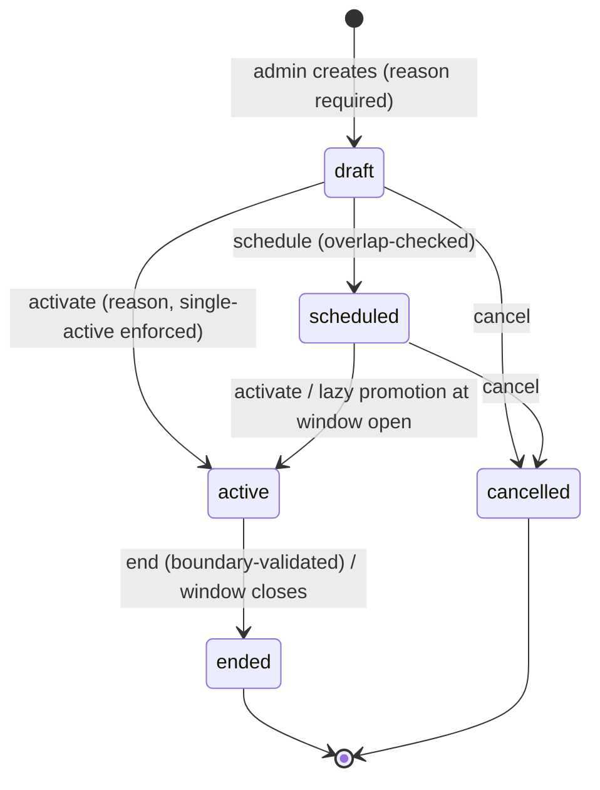
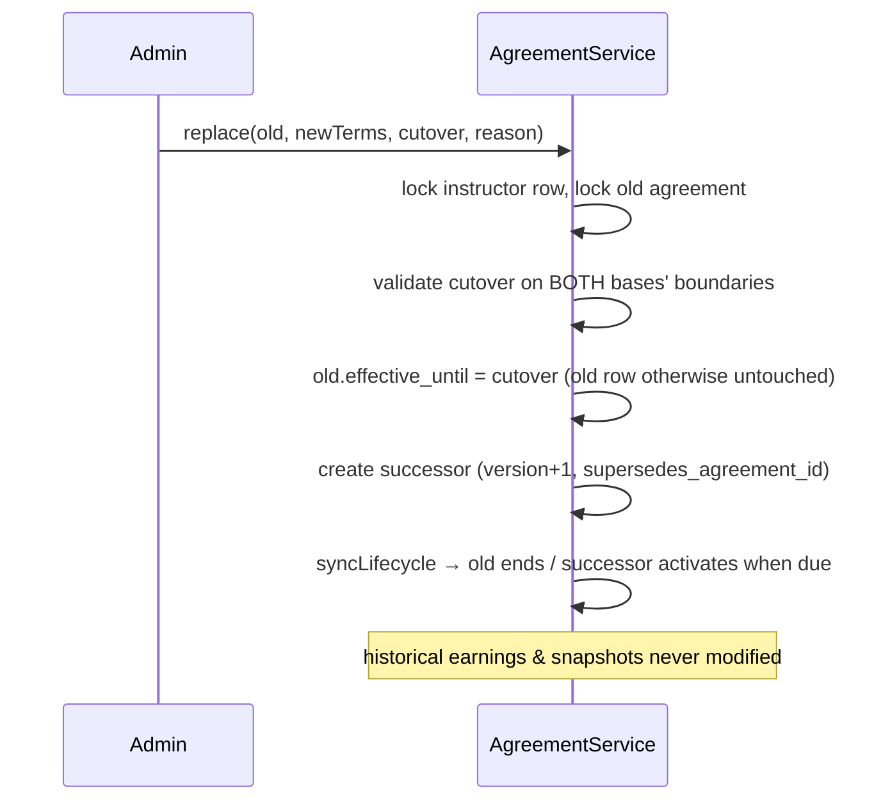
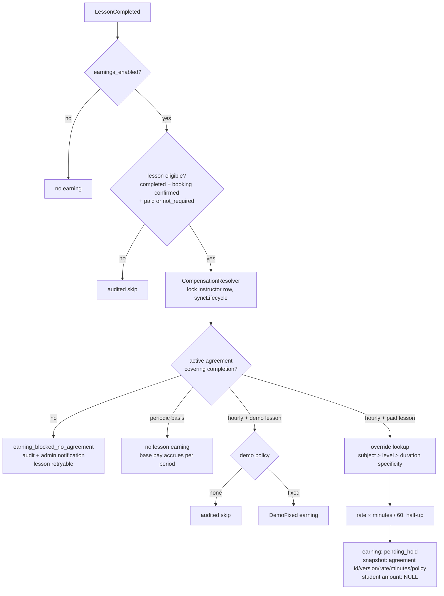
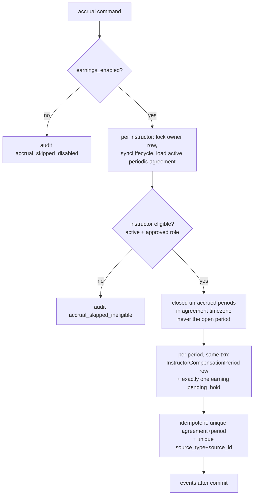

# Phase 14.2 — Instructor Compensation Model Correction & Pay Agreement Foundation

> **⚠️ Superseded (Phase 14.4).** Still accurate in substance, but the deprecated commission enum cases and legacy columns it retained defensively were fully removed in Phase 14.4 (zero historical rows existed). The canonical, current
> reference is [docs/financial-domain-architecture.md](../financial-domain-architecture.md);
> this file remains as a historical phase record only.

## 1. The original problem

Phase 14 calculated instructor earnings as a **percentage of the
student-facing price** (default 70%), with a global fixed amount as
fallback. That is a commission model. The approved business model is
the opposite: student pricing is platform-controlled and instructor
compensation is an **internal administrator decision** informed by
experience, qualifications, and expertise — never a formula over the
price, and never automatically derived from those decision inputs.

Audit finding: the commission path ran from `LessonCompleted` →
`InstructorEarningService::calculate()` →
`resolveStudentAmount()` (captured payment / booking price) →
`floor(price × pct)`. **Zero earnings had ever been created** under it
in any environment, so no historical migration was needed.

## 2. The corrected model

Compensation comes exclusively from an **effective-dated
InstructorCompensationAgreement** (`ICA-…`, UUID, versioned), decided
per instructor by finance-authorized admins:

| Basis | Meaning | Earning trigger |
|---|---|---|
| `hourly` | amount per 60 eligible teaching minutes | one earning per eligible completed lesson |
| `daily` | fixed amount per payable day | accrual sweep, one earning per closed day |
| `weekly` | fixed amount per ISO Mon–Sun week | accrual sweep, one per closed week |
| `monthly` | fixed amount per calendar month | accrual sweep, one per closed month |

Compensation basis ≠ settlement frequency: hold/release, settlement
batches, and Phase 15 withdrawals are untouched and operate on the
resulting earnings identically regardless of basis.

### Hourly calculation

`amount = round_half_up(rate_minor × eligible_minutes / 60)` — pure
integer arithmetic in `CompensationMath` (the single implementation),
policy `half_up_minor` stored in every snapshot. Example: 1001 × 45/60
= 750.75 → **751**. Eligible minutes = lesson `starts_at → ends_at`.

### Effective dating & period alignment (V1)

Hourly agreements start any time. Daily agreements start on a day
boundary, weekly on Monday 00:00, monthly on the 1st 00:00 — all in
the **agreement timezone** — and end on a matching boundary. There is
**no proration formula anywhere**: no ÷30, ÷31, ÷365, no
lesson-count division, no implied commission. Partial-period
corrections are future audited adjustments.

## 3. Agreement lifecycle

- One active agreement per instructor — service owner-row lock **plus**
  a STORED generated-column unique index
  (`ica_active_owner_unique`), the same partial-unique emulation proven
  in Phase 15.1.
- Effective windows of active/scheduled agreements may never overlap.
- **Active financial terms are immutable** (policy denies `update`, no
  edit surface exists); rate changes go through **replace**:

- Nothing is hard-deleted; cancelled/ended agreements stay auditable.
- `syncLifecycle` settles time-based transitions lazily (expire → then
  promote), always under the instructor owner lock, system-audited.

## 4. Earning creation

The resolver's signature makes the guarantee structural: **student
price, payment, wallet, margin, discount, and gateway amounts are not
parameters** and `CompensationResolution` has no field to carry them.
There is no percentage fallback, no student-price fallback, no silent
global fixed amount, and no zero-earning guess.

### Periodic accrual (`instructor-earnings:accrue-periodic-compensation`, hourly schedule)

## 5. Earnings source model

`instructor_earnings` remains the **single canonical settleable /
withdrawable source** — Phase 15 reservations work on periodic
earnings unchanged (test-proven end to end: accrue → release →
reserve). Changes: `lesson_id`/`booking_id` became nullable (lesson
uniqueness still DB-enforced — MySQL unique indexes allow NULLs), and
`(source_type, source_id)` is now unique (`ie_source_unique`).
Source categories in use: `lesson` and `periodic_compensation`;
`incentive` / `adjustment` / `reversal` are reserved naming for future
phases, not implemented surfaces.

## 6. Commission removal & historical safety

Removed from active use: the `calculate()`/`resolveStudentAmount()`
commission methods, the `EarningCalculation` DTO, and the four global
settings (`default_calculation_type`, `default_percentage`,
`default_fixed_amount_minor`, `default_currency_code`) — deleted by an
explicit settings migration, safe because **every earning carries its
own immutable snapshot** and zero percentage-based earnings existed.
`EarningCalculationType::Percentage/Fixed` remain as `@deprecated`
cases purely for historical reads; `activeCases()` excludes them and
the resolver can only produce `hourly` / `periodic` / `demo_fixed`.
New earnings persist `student_amount_minor = NULL` and
`platform_margin_minor = NULL`; the legacy columns stay for historical
rows, which are never recalculated, rewritten, or deleted
(test-covered including snapshot stability across rate replacement).

## 7. Demo compensation

Demo lessons (booking payment not required) follow an explicit policy:
`none` (default — audited skip) or `fixed_demo_amount`
(`demo_fixed_amount_minor`, agreement currency, `demo_fixed`
calculation type). `demo_to_paid_incentive` / `hybrid` are documented
future policies, deliberately not implemented. Demo policy never
touches the base agreement and never reads student pricing.

## 8. Kill switches (both remain OFF)

`earnings_enabled = false` and `withdrawals_enabled = false` — verified
in the live database, **forced and now defaulted to false** by the
settings migration. Enforcement is inside the domain services
(`InstructorEarningService::createFromLesson`,
`InstructorPeriodicCompensationService::accrueClosedPeriods`,
`InstructorWithdrawalService::requestWithdrawal`), so commands,
events, listeners, and admin actions cannot bypass them — the Filament
toggle is presentation only. Do **not** enable earnings until at least
one valid agreement exists and the admin has reviewed the setup; the
settings page shows the operational counts (active/scheduled/missing
agreements per basis) to support that review.

## 9. Admin surface, permissions, audit

- **Filament → Earnings → Compensation Agreements**: list-only resource
  with guarded header "New Agreement" action and per-record
  schedule / activate / replace / end / cancel / add-override / view /
  history actions — mandatory internal reasons, no delete, no status
  dropdown, no editing of active terms. Decision context (experience,
  qualifications, subjects) is displayed in the view modal to inform
  the admin, never to compute anything. Users table gained a
  "Manage Compensation" shortcut for instructors.
- **Global settings page** kept operations (earnings switch, hold,
  auto-release, settlement, withdrawals, demo policy) and replaced the
  commission section with the informational compensation section +
  counts + manage link.
- **Permissions** (`InstructorCompensationPermissionSeeder`, manager):
  `ViewAny/View/Create/Schedule/Activate/End/Cancel/ViewHistory/Configure:InstructorCompensationAgreement`.
  Instructors can view their own agreement (internal reason/notes are
  `$hidden`) but hold no mutation permission; super-admin bypass
  preserved.
- **Audit** (`instructor_compensation` log via `AuditTrailService`):
  drafted / scheduled / activated / replaced / ended / cancelled /
  override added·applied / periodic accrued / accrual skipped
  (disabled, ineligible) / earning blocked (no agreement — also raises
  an admin notification through the NotificationMapper). Metadata is
  reference/basis/amount/currency/period/actor/reason only — never
  student price, margin, or payout details.

## 10. Deferred (documented, not built)

Automatic tier systems (experience→rate automation), demo-to-paid /
hybrid incentive policies, incentive & adjustment earning sources, an
automated retry sweep for `earning_blocked_no_agreement` lessons
(re-invoking `createFromLesson` is already safe and idempotent),
per-override independent effective dating (overrides inherit the
agreement window by design), and everything Phase 16 (payout
execution).

## 11. Deployment & rollback

Deploy: `php artisan migrate --force` (4 tables + settings correction;
forces `earnings_enabled = false`), then
`php artisan db:seed --class=InstructorCompensationPermissionSeeder --force`;
the hourly scheduler entry for
`instructor-earnings:accrue-periodic-compensation` ships in
`routes/console.php`. Then configure agreements (hourly first is the
recommended rollout), review, and only then enable earnings.
Rollback: both kill switches off restores the fully-safe state at any
moment; migrations have `down()`s, but with zero legacy earnings the
practical rollback is simply disabling the switches — historical data
is never at risk because nothing rewrites it.
