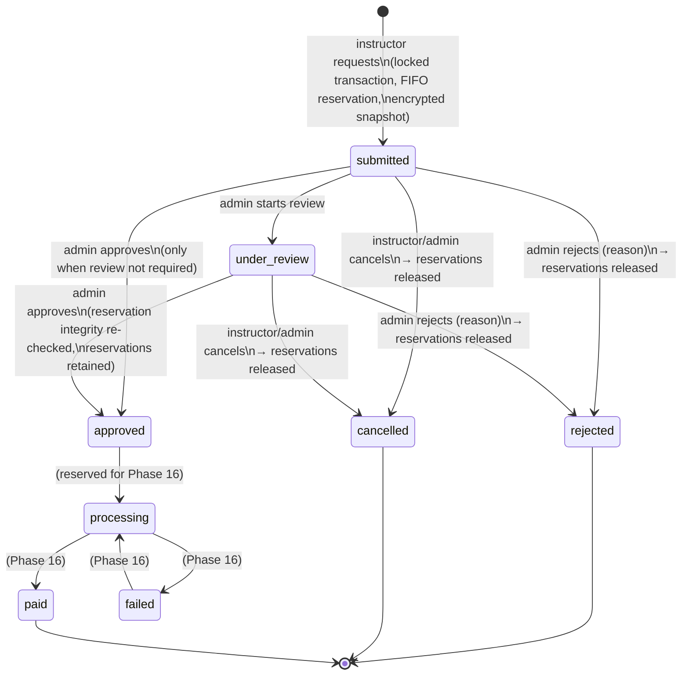

# Phase 15 — Instructor Payout Method & Withdrawal Request Foundation

> **⚠️ Superseded (Phase 14.4).** Content remains accurate; consolidated into the canonical document. The canonical, current
> reference is [docs/financial-domain-architecture.md](../financial-domain-architecture.md);
> this file remains as a historical phase record only.

Secure self-service payout destinations and withdrawal requests on top
of the Phase 14 earnings ledger. **No money moves anywhere in this
phase** — a withdrawal only *reserves* released earnings and freezes an
encrypted payment-destination snapshot; actual bank execution is the
next phase.

## Scope

- Instructor payout methods (bank transfer only), with a
  draft → verification → verified lifecycle and a single default.
- Encrypted-at-rest bank details, masked everywhere, keyed-HMAC
  fingerprint duplicate detection.
- Available-withdrawal balance derived from canonical Phase 14 rows.
- Withdrawal requests with FIFO earnings reservation, immutable
  encrypted payout snapshots, and an admin review workflow
  (start review / approve / reject / cancel).
- Policies, Shield-style permissions, audit trail, queued
  notifications, Livewire pages, Filament resources, tests.

## Architecture

Extends the existing `app/Earnings/` domain (no parallel financial
architecture):

- Models: `InstructorPayoutMethod`, `InstructorWithdrawalRequest`,
  `InstructorWithdrawalAllocation` (in `app/Models/`, UUID PKs).
- Enums: `PayoutMethodType`, `PayoutMethodStatus`,
  `InstructorWithdrawalStatus`, `WithdrawalAllocationStatus` — labels,
  colors, and the full transition matrices live here only.
- Services (bound in `EarningServiceProvider`, all interface-first):
  `PayoutMethodFingerprintService`, `PayoutMethodSnapshotService`,
  `InstructorPayoutMethodService`, `InstructorWithdrawalBalanceService`,
  `InstructorWithdrawalAllocationService`, `InstructorWithdrawalService`.
- `App\Earnings\Support\InstructorPayoutEligibility` is the single
  definition of "eligible instructor" (active account + instructor role
  + approved/active `instructor_status`).
- No controller, Livewire component, or Filament action mutates
  financial state directly — everything passes through the services,
  which own transactions, locking, transition guards, audit entries,
  and after-commit events.

## Database schema

### `instructor_payout_methods` (soft deletes)

instructor FK → users; `type` (bank_transfer); country/currency FKs +
`currency_code`; `display_label` + `masked_identifier` (the only
outward-facing identity); `fingerprint` (HMAC, hidden);
`encrypted_details` (Laravel `encrypted:array` cast); `status`;
`is_default`; submitted/verified/rejected/disabled stamps with actor
FKs; `last_used_at`. Indexes: instructor+status, instructor+is_default,
instructor+fingerprint, status, type.

### `instructor_withdrawal_requests` (never deleted)

Unique `reference` (`WD-YYYYMM-XXXXXXXX`); instructor + payout-method
FKs; currency FK + code; unsigned integer minor-unit money columns
(`amount_minor`, `fee_minor` = 0 this phase, `net_amount_minor`,
`available_balance_before/after_minor`); frozen destination surface
(`payout_method_type/label`, `masked_identifier`) plus
`encrypted_payout_method_snapshot`; `status`; `idempotency_key`
(unique per instructor: `iwr_instructor_idempotency_unique`);
instructor note / internal review note / rejection reason; full
timestamp + actor audit trail including *future-only*
processing/paid/failed columns. **No `settlement_batch_id`**: Phase 14
batches settle earnings directly and are semantically parallel to
withdrawals — linking them is deferred to the execution phase rather
than forced.

### `instructor_withdrawal_allocations` (never deleted)

withdrawal-request + earning FKs; currency; `amount_minor` (partial
amounts supported); `status` (reserved/released/consumed);
reserved/released/consumed timestamps. Unique request+earning
(`iwa_request_earning_unique`), indexed earning+status.

## Payout-method lifecycle

```
draft → pending_verification → verified → disabled
              ↓         ↑
           rejected ────┘   (correct + resubmit)
```

- Draft and rejected methods are the only editable states; editing a
  rejected method resets it to draft and clears the rejection.
- Sensitive details are always re-entered in full — stored values are
  never sent back to the browser.
- Verified details are immutable; changing banks = new method.
- Only a verified method can be default; the service enforces exactly
  one default per instructor with `lockForUpdate()`.
- Disable requires no active withdrawal depending on the method, and
  clears the default flag. Disabled is terminal.

## Withdrawal lifecycle



`InstructorWithdrawalStatus::allowedTransitions()` is the single
transition matrix; `processing`/`paid`/`failed` exist in the enum and
schema but are unreachable from every Phase 15 service method, UI, and
permission.

## Balance calculation

`InstructorWithdrawalBalanceService::calculate(instructor, currency)`:

```
gross    = Σ earning_amount_minor of earnings where
           status = releasable AND settlement_batch_id IS NULL
           AND instructor + currency match          (scopeWithdrawable)
reserved = Σ allocation.amount_minor where status ∈ (reserved, consumed)
           and the earning is in that pool
available = max(0, gross − reserved)
```

No stored balance column exists anywhere; the DTO
(`WithdrawalBalance`) also carries min/max limits and a
`canWithdraw`/`blockingReason` pair for the UI. Display reads are
unlocked; **submission always recalculates inside the transaction with
the earning rows locked**.

## Reservation algorithm & locking

`InstructorWithdrawalService::requestWithdrawal()` — one transaction:

1. `lockForUpdate()` the instructor's `users` row — the canonical
   financial scope; concurrent submissions for one instructor
   serialize here.
2. Idempotency-key lookup (replay returns the original request).
3. Active-request limit check.
4. Re-read the payout method under lock; re-validate ownership,
   verified status, usability.
5. Lock the eligible earnings FIFO
   (`released_at ASC, created_at ASC, id ASC`).
6. Recalculate available balance; validate amount against minimum,
   maximum, and balance.
7. Create the request (reference, balance snapshots, encrypted
   destination snapshot).
8. `InstructorWithdrawalAllocationService::reserve()` walks the locked
   earnings FIFO, allocating each earning's *unheld remainder*
   (partial split on the last earning); aborts the whole transaction
   if it cannot cover the amount exactly.
9. Commit; audit entry + `InstructorWithdrawalRequested` fire only
   after commit and only for a fresh (non-replayed) request.

Release: rejection and cancellation flip every reserved allocation to
`released` *in the same transaction* as the status change. Approval
retains reservations and first re-verifies that the reserved sum still
equals the request amount.

Phase 14 boundary: `InstructorEarning::scopeSettleable()` now also
excludes earnings holding a live reservation, so the same rupee can
never be both batch-settled and withdrawal-reserved; conversely,
batch-assigned earnings never enter the withdrawal pool.

## Idempotency

- A UUID idempotency key is minted server-side when the Livewire form
  opens and locked for that form lifetime; replays return the original
  request without touching reservations.
- DB-enforced: unique `(instructor_id, idempotency_key)` and unique
  `reference`.
- Plus the instructor-row lock, the active-request limit, per-user
  rate limiting (`RateLimiter`), and `wire:loading` button disabling.

## Currency rules

One request = one currency (the payout method's); all allocations are
currency-checked against the request; conversion does not exist; the
`Currency` table is the canonical source (methods and requests store
both `currency_id` and `currency_code` like Phase 14); historical rows
keep their captured currency forever.

## Encryption, masking, fingerprint

- `encrypted_details` and `encrypted_payout_method_snapshot` use
  Laravel `encrypted:array` casts (app-key encryption at rest);
  both are `$hidden`, as are `fingerprint`, `internal_review_note`,
  and `idempotency_key`.
- Outward identity is only `display_label` / `masked_identifier`
  ("Bank Transfer ending in 4821").
- Fingerprint = HMAC-SHA256(app key) over
  `type|country|currency|account-or-iban|routing|swift`, normalized
  (uppercase, spaces/dashes stripped) — deterministic duplicate
  detection per instructor without a brute-forceable plain hash. Never
  returned to any client.
- The snapshot (schema_version 1) is captured exactly once at request
  creation and never regenerated; disabling or relabeling the method
  cannot change where an approved request will pay.

## Sensitive-detail access (admin)

Filament shows masked identifiers only. "View Details" is a dedicated
action gated by `ViewSensitive:InstructorPayoutMethod`; decryption
happens inside `viewSensitiveDetails()` at modal render (never in
table state or URLs), and the *access* is written to the audit trail
(`payout_method_sensitive_viewed`) without the values.

## Permissions (`InstructorPayoutPermissionSeeder`, manager role)

```
ViewAny/View/ViewSensitive/Verify/Reject/Disable : InstructorPayoutMethod
ViewAny/View/StartReview/Approve/Reject/Cancel   : InstructorWithdrawalRequest
```

Instructor self-service is ownership-scoped in
`InstructorPayoutMethodPolicy` / `InstructorWithdrawalRequestPolicy`
(no staff permission involved); `delete`/`update` are hard-denied for
everyone below the `Gate::before()` super-admin bypass. No
payout-execution (mark-paid) permission exists.

## Settings (`InstructorEarningSettings`, group `instructor_earnings`)

| Setting | Default | Meaning |
|---|---|---|
| `withdrawals_enabled` | false | Kill switch for the whole flow |
| `minimum_withdrawal_minor` | 50000 | ₹500.00 floor |
| `maximum_withdrawal_minor` | null | No cap |
| `maximum_active_requests_per_instructor` | 1 | Open-request limit |
| `payout_method_verification_required` | true | Verified methods only |
| `instructor_cancellation_enabled` | true | Self-cancel allowed |
| `withdrawal_review_required` | true | Must enter review before approval |

Managed on the existing `/admin/settings/instructor-earnings` page
(new "Withdrawals" section).

## Instructor UI (Livewire)

- `/dashboard/instructor/payout-methods` → `PayoutMethodsManager`:
  masked list, status badges, default indicator, add/correct bank
  form (sensitive fields are write-only and cleared from component
  state immediately after submit — never repopulated from storage),
  submit-for-verification, make-default, disable, rejection reasons.
- `/dashboard/instructor/withdrawals` → `WithdrawalsManager`:
  per-currency balance cards with limits and blocking reasons,
  request form (verified methods only, default preselected), masked
  confirmation step, history with fee/net and cancel where allowed.
- Both pages sit inside the `/dashboard` middleware stack
  (auth, verified email, active account, frontend portal) plus an
  instructor-role check; both components re-resolve every record
  ownership-scoped and rate-limit submissions. Sidebar entries added
  in `AccountMenuService` (instructor audience).

## Filament admin

- **Payout Methods** (`/admin/instructor-payout-methods`): list-only
  resource (no create/edit/delete), masked columns, filters
  (status/type/country/currency/default/submitted period), actions:
  secure view-details, verify, reject (reason required), disable.
- **Withdrawal Requests** (`/admin/instructor-withdrawal-requests`):
  list-only, no generic mutation of any financial field, filters
  (status/instructor/currency/reviewed/requested period), actions:
  start review, approve (integrity re-check), reject (reason
  required), cancel. No mark-paid anywhere.

## Events & notifications

Domain events (after commit, no listeners — future subscription
points): `InstructorPayoutMethodSubmitted/Verified/Rejected/Disabled`,
`InstructorWithdrawalRequested/ReviewStarted/Approved/Rejected/Cancelled`.

Notifications follow the Activity Log pipeline (log name
`instructor_payouts`): `NotifyInstructorOnPayoutActivity` (queued,
`notifications` queue) fans audit entries out to
`InstructorPayoutMethodStatusNotification` /
`InstructorWithdrawalStatusNotification` (database + mail; reference,
formatted amount, masked label, safe reason — never bank details,
snapshots, or internal notes). `NotificationMapper` raises admin
notifications for `payout_method_submitted` and `withdrawal_requested`.

## Test coverage (`tests/Feature/Earnings/`)

`InstructorPayoutMethodTest` (25), `InstructorWithdrawalTest` (36),
`InstructorPayoutPermissionSeederTest` (3),
`InstructorPayoutAdminPanelTest` (5), `InstructorPayoutLivewireTest`
(13): encryption at rest, serialization hiding, fingerprint opacity,
duplicate normalization, editing immutability, verification workflow,
single default, balance derivation and currency isolation, FIFO +
partial allocation, idempotent replay, over-reservation impossibility,
settlement/withdrawal mutual exclusion, the full transition matrix,
reservation release/retention, snapshot immutability, policy
ownership, panel rendering + masked output, Livewire ownership/
validation/double-submit, and queued safe notifications.

## Explicitly deferred (Phase 16 — payout execution)

External payout providers (RazorpayX / Stripe Connect / PayPal /
Wise / bank APIs), provider onboarding, webhooks, provider transaction
IDs, processing retries and failure recovery, marking requests paid,
reconciliation, settlement/accounting export, tax withholding,
currency conversion, withdrawal fees (schema-ready, `fee_minor` = 0),
chargeback recovery, multi-provider routing, linking withdrawals to
Phase 14 settlement batches. No placeholder routes or dead buttons
were added for any of these.

## Phase 16 handoff

- Execute payouts from **approved** requests via
  `approved → processing → paid/failed` (matrix already reserved).
- On `paid`: allocations → `consumed`, earnings → `settled`
  (decide there how this reconciles with `settlement_batch_id`).
- On terminal `failed`: release reservations (new rule, not present
  yet by design).
- The encrypted snapshot — not the live payout method — is the payment
  instruction source.

## Deployment runbook

1. `php artisan migrate --force` — three tables + withdrawal settings
   defaults (withdrawals ship **disabled**).
2. `php artisan db:seed --class=InstructorPayoutPermissionSeeder --force`
   — mandatory (deny-by-default policies).
3. Queue worker on the `notifications` queue.
4. Enable `withdrawals_enabled` in the admin settings page when ready.
