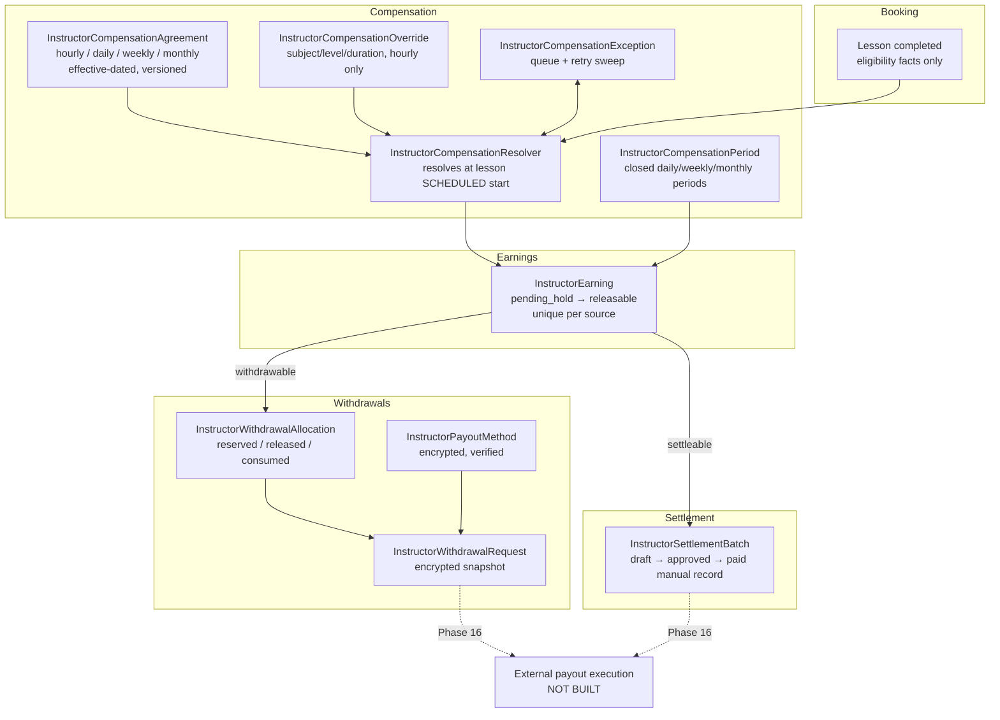
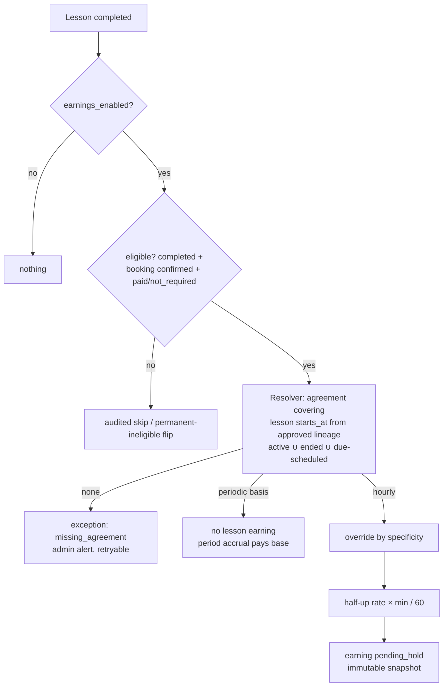
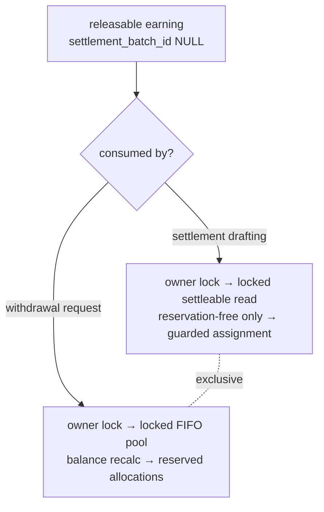
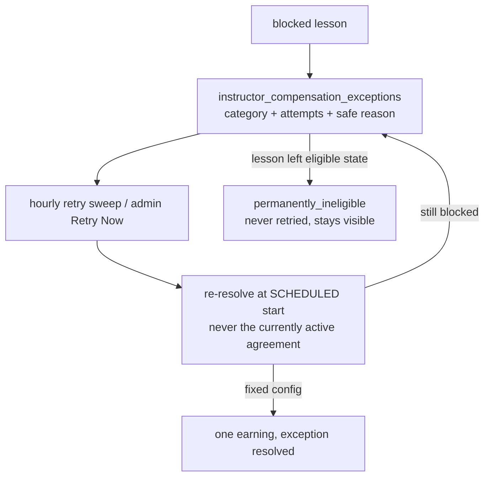

# Financial Domain Architecture (Canonical)

**The single authoritative developer document for the instructor
financial flow** (Phases 14 → 15.1, consolidated by the 14.4 cleanup).
The per-phase documents under `docs/architecture/phase-14*` and
`phase-15*` are historical records; where they conflict with this
document, this document wins.

## 1. Business rules (SRS-derived, non-negotiable)

1. **Instructor compensation is independent of student pricing.** The
   commission model was removed entirely in 14.2/14.4 — no executable
   code multiplies a price by a percentage, no schema column links them,
   and architecture tests fail the build if either returns.
2. Compensation is an **internal administrator decision** captured in
   effective-dated agreements. Experience/qualifications inform the
   admin; they are never a formula.
3. **Historical financial values are immutable** — earnings, snapshots,
   allocations, settlements, and payout snapshots are never
   recalculated, rewritten, or hard-deleted.
4. Every earning, settlement, reservation, and withdrawal is traceable:
   immutable per-row snapshots + `AuditTrailService` entries.
5. **No external money movement exists anywhere.** Phase 16 (payout
   execution) is deliberately unbuilt.

## 2. Complete architecture



## 3. Domain ownership (one owner per fact)

| Domain | Owns | Never does |
|---|---|---|
| Booking/Lesson | scheduling, duration, participants, completion & payment-eligibility facts | calculate compensation, write earnings |
| Compensation | agreement selection/version, overrides, amount, rounding, exceptions, period boundaries | read student price (structurally impossible — the resolver takes only a `Lesson`) |
| Earnings | earning creation, status machine, hold/release, reversal, snapshots, settleable/withdrawable eligibility | move money |
| Settlement | batch lifecycle, earning assignment, totals | create withdrawal allocations |
| Withdrawals | payout methods, balance, reservations, requests, destination snapshots | assign settlement batches |
| Payout execution (future) | transfers, provider refs, processing/paid/failed, webhooks, reconciliation | — |

## 4. Lifecycles

**Agreement** `draft → scheduled → active → ended` (+ `cancelled` from
draft/scheduled). One active per instructor (owner lock + generated-
column unique `ica_active_owner_unique`); windows never overlap; active
terms immutable — changes are versioned replacements
(`supersedes_agreement_id`). Periodic bases (daily/weekly/monthly)
cannot activate while `periodic_compensation_enabled` is off.

**Earning** `pending_hold → releasable → settled` with `disputed_hold`
(park/restore), `reversed`, `cancelled`. All transitions via
`InstructorEarningService` + `TransitionInstructorEarningAction`;
`settled`/`reversed`/`cancelled` terminal.

**Settlement batch** `draft → approved → paid` (manual money-moved
record; `processing`/`failed` reserved), `cancelled` from draft/failed
returns earnings to the pool.

**Payout method** `draft → pending_verification → verified → disabled`
(+ rejected→corrected→resubmit). Verified details immutable; disable is
blocked while any active withdrawal depends on the method.

**Withdrawal** `submitted → under_review → approved / rejected /
cancelled` (execution states `processing/paid/failed` reserved,
unreachable). Rejection/cancellation releases reservations in the same
transaction; approval re-verifies full integrity and retains them.

**Compensation exception** open → (retried) → resolved, or flipped to
`permanently_ineligible` (never retried). One open row per lesson.

### Agreement-to-earning flow



### Settlement vs withdrawal decision



An earning is settleable **or** withdrawal-reserved, never both:
`scopeSettleable` excludes reserved earnings, `scopeWithdrawable`
excludes batch-assigned earnings, and both consumers take the same
locks (below) — proven by real multi-process MySQL races.

### Compensation recovery



## 5. Lock ordering (canonical, deadlock-free by construction)

```text
1. users row of the instructor      ← every financial writer takes this FIRST
2. withdrawal request row
3. payout method / agreement row
4. instructor earnings, FIFO (released_at, created_at, id)
5. withdrawal allocations
6. settlement batch aggregate
```

Writers that take the owner lock first: withdrawal creation, settlement
drafting, periodic accrual, agreement lifecycle (schedule/activate/
end/cancel/replace), payout-method default/disable, compensation
resolution. Withdrawal transitions lock the request row then
allocations/earnings — same relative order, no cycle. No retry wrapper
exists on purpose: an InnoDB 1213 here is a lock-order regression, not
something to retry. Negative proof executed in 15.1: with the locks
removed, the race tests fail with double-spend.

## 6. Idempotency

| Operation | Mechanism |
|---|---|
| Lesson earning | unique `lesson_id` + unique `(source_type, source_id)` + idempotent service hit |
| Periodic earning | unique `(agreement_id, period_start, period_end)` + `(source_type, source_id)` |
| Withdrawal submission | server-minted UUID key, payload-bound (altered input = conflict), unique `(instructor_id, idempotency_key)` |
| Withdrawal reference | collision-loop + DB-unique |
| Release sweep / accrual / retry commands | re-runnable; DB constraints make duplicates impossible |
| Exception rows | unique `lesson_id`, updated in place |

## 7. Money & currency

Integer minor units everywhere; `App\Support\MoneyFormatter` is the
single formatter/parser (exponent from `currencies.minor_units`,
string/integer math, precision rejected not truncated; the wallet
formatter delegates to it). `CompensationMath::hourlyAmount()` is the
single rounding implementation (`half_up_minor`, in every snapshot).
One currency per agreement/earning/withdrawal; allocations
currency-checked both ways; conversion does not exist. Snapshot
currency codes are immutable copies.

## 8. Settings & kill switches (`InstructorEarningSettings`)

`earnings_enabled`, `periodic_compensation_enabled`, and
`withdrawals_enabled` all default **false** and can only change through
**`FinancialFeatureConfigurationService`** (Phase 14.5): the settings
class itself rejects any other save that flips one of them, every
enable operation runs its activation preflight regardless of caller
(Filament merely relays and displays the typed `FeatureReadiness`
result), and each toggle is audited with the acting admin. Documented
rule: **disabling earnings transactionally auto-disables periodic
compensation.** Withdrawal enablement does not require Phase 16
provider credentials — requests only reserve earnings. Operational
settings (hold/release, settlement minimum + informational frequency,
withdrawal limits/verification/cancellation/review, demo policy,
`compensation_retry_max_attempts`) save normally, and gating is still
enforced inside the domain services — no command, event, or UI can
bypass a switch. The only test-side bypass is
`Tests\Support\ManagesFinancialSettings` (fixture setup; absent from
production namespaces, architecture-tested).

## 9. Events, listeners, notifications

Domain events (`InstructorEarningCreated/Released`,
`InstructorSettlementPaid`, payout-method + withdrawal lifecycle
events) dispatch **after commit** and have no listeners yet —
subscription points for future phases. Notifications ride the
`ActivityCreated` pipeline: services write `AuditTrailService` entries
(log names `instructor_earnings`, `instructor_compensation`,
`instructor_payouts`); `NotifyAdminsOnActivity` (via
`NotificationMapper`) raises admin alerts (payout method submitted,
withdrawal requested, earning blocked — no agreement);
`NotifyInstructorOnPayoutActivity` sends instructor notifications
(queued, `notifications` queue, safe payloads only). Listener retries
are read-only against financial tables. Direct `activity()` calls are
prohibited and architecture-tested.

## 10. Scheduled commands (all idempotent, `withoutOverlapping`)

| Command | Cadence | Gate |
|---|---|---|
| `instructor-earnings:release` | hourly | `auto_release_enabled` |
| `instructor-earnings:accrue-periodic-compensation` | hourly | `earnings_enabled` + `periodic_compensation_enabled` |
| `instructor-earnings:retry-blocked-lessons` | hourly | `earnings_enabled`; backoff-aware (`next_retry_at`) |

**Retry backoff (Phase 14.5):** attempt 1 retries at the next sweep,
then +2 h, +6 h, +24 h, then daily, until
`compensation_retry_max_attempts` (default 10) marks the exception
**exhausted** (`retry_exhausted_at`) — excluded from the sweep forever,
still visible in the queue, still manually retryable by admins holding
`Configure:InstructorCompensationAgreement`. Permanent failures never
enter the schedule at all.

## 11. Permission matrix (Shield naming, manager via seeders, super-admin bypass)

| Seeder | Grants |
|---|---|
| `InstructorEarningPermissionSeeder` | ViewAny/View/Release/Reverse:InstructorEarning · ViewAny/View/Create/Approve/MarkPaid/Cancel:InstructorSettlementBatch — Update/Delete permissions were **removed** in 14.5: earnings and batches are immutable records; the seeder also deletes the stale rows idempotently |
| `InstructorPayoutPermissionSeeder` | ViewAny/View/ViewSensitive/Verify/Reject/Disable:InstructorPayoutMethod · ViewAny/View/StartReview/Approve/Reject/Cancel:InstructorWithdrawalRequest |
| `InstructorCompensationPermissionSeeder` | ViewAny/View/Create/Schedule/Activate/End/Cancel/ViewHistory/Configure:InstructorCompensationAgreement (exceptions page reuses ViewAny; retry reuses Configure) |

Instructor self-service (own payout methods, own withdrawals, own
agreement visibility) is ownership-scoped in policies, permission-free.
No payout-execution permission exists.

## 12. Sensitive data

Encrypted at rest (`encrypted:array`, APP_KEY): payout-method details,
withdrawal destination snapshots. Always `$hidden`: those two payloads,
fingerprints, idempotency keys, internal review notes, agreement
internal reasons/notes, earning notes/metadata. Decryption happens only
in `viewSensitiveDetails()` (permission `ViewSensitive:…`,
access-audited without values) and withdrawal-approval integrity
checks. `APP_KEY` operations: back up separately from DB backups;
rotation requires explicit re-encryption via `APP_PREVIOUS_KEYS`;
corrupted payloads fail with safe domain messages.

## 13. Operational activation checklist

1. `php artisan migrate --force`
2. Seed all three permission seeders (deny-by-default policies).
3. Queue worker on `notifications`; scheduler cron running.
4. Create + activate **hourly** agreements for every payable instructor.
5. Clear the Compensation Exceptions queue.
6. Enable `earnings_enabled` (the preflight must pass; it names failing
   instructors otherwise).
7. Verify one real lesson → earning → hold → release cycle.
8. Enable `withdrawals_enabled`; verify method verification → request →
   reservation.
9. `periodic_compensation_enabled` stays off until daily/weekly/monthly
   attendance/leave/partial-period rules are formally defined.
10. Phase 16 payout execution remains unbuilt — settlement "mark paid"
    is a manual money-moved record only.

## 13a. Canonical migrations & database rebuild (Phase 14.5)

The financial schema lives in **ten consolidated migrations**
(`2026_07_29_1000xx`): agreements → overrides → periods → settlement
batches → earnings → compensation exceptions → payout methods →
withdrawal requests → withdrawal allocations → financial settings.
They encode every guarantee directly (generated-column uniques, CHECK
constraints, named composite indexes, restrictive FKs, switch defaults
OFF) — no commission-era history exists in the baseline. Fresh install:
`php artisan migrate --force` + the three permission seeders. Disposable
dev rebuild: `php artisan migrate:fresh --force` (dev/testing only —
production would use the same set from day one). Schema parity between
the consolidated set and the previously applied chain was machine-
verified across columns, types, nullability, defaults, indexes, unique
constraints, generated columns, CHECK constraints, and FK delete rules.

## 13b. Phase 16 handoff requirements

Payout execution must: consume **approved** withdrawal requests via the
reserved `approved → processing → paid/failed` transitions; pay from
the **encrypted snapshot**, never the live payout method; convert
reservations to `consumed` and earnings to `settled` on `paid`; define
the release rule for terminal `failed`; add its own provider
credentials/webhooks/reconciliation without touching any Phase ≤15
invariant; and keep `withdrawals_enabled` gating requests independently
of execution readiness.

## 14. Troubleshooting

| Symptom | Look at |
|---|---|
| Lesson completed, no earning | Compensation Exceptions page — category tells you why; fix config, retry resolves at the lesson's scheduled start |
| "Earnings cannot be enabled yet" | The preflight notification lists exact failing instructors/checks |
| Balance lower than expected | Reserved allocations (live withdrawal) or batch assignment — both visible on the earning row |
| Periodic agreement not paying | `periodic_compensation_enabled` + agreement status + accrual log (`storage/logs/instructor-earnings-accrual.log`) |
| Payout method can't be disabled | An active withdrawal references it — resolve the withdrawal first (by design) |
| InnoDB 1213 in financial code | Lock-order regression — see §5; do **not** add a retry wrapper |

## 15. Deferred (Phase 16+)

External payout execution (providers, webhooks, processing/paid/failed,
reconciliation, provider IDs), withdrawal fees (schema-ready),
tax/TDS/GST, incentive & adjustment earning sources, automatic tiers,
demo-to-paid/hybrid demo policies, withdrawal↔settlement-batch linkage,
currency conversion.
