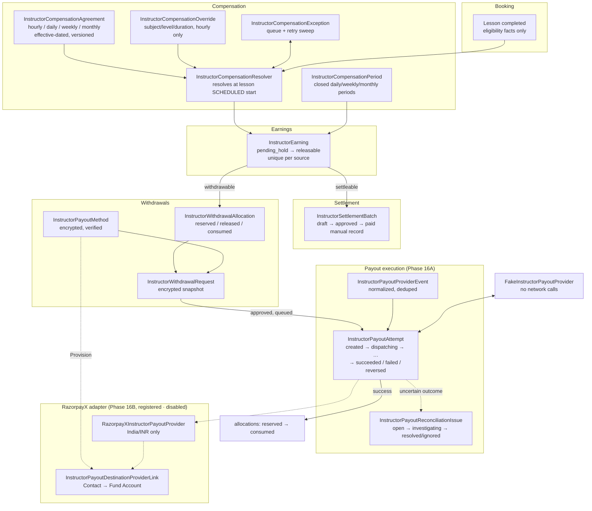
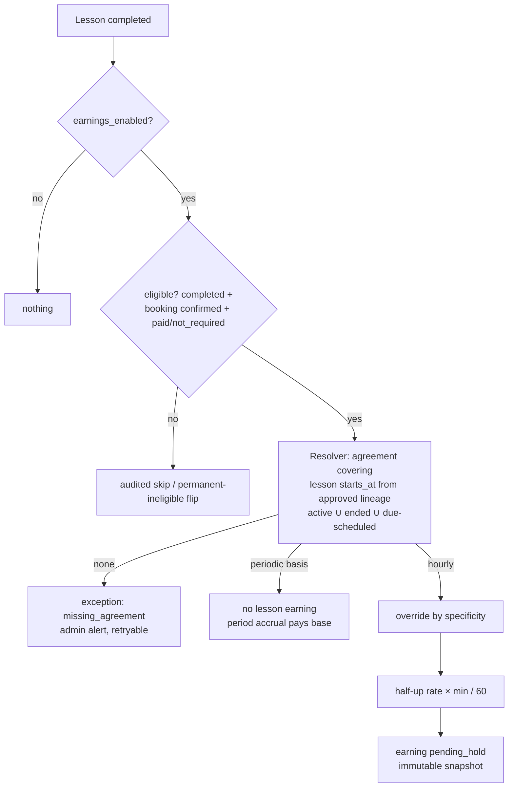
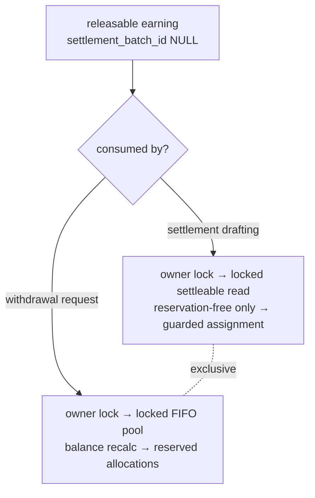
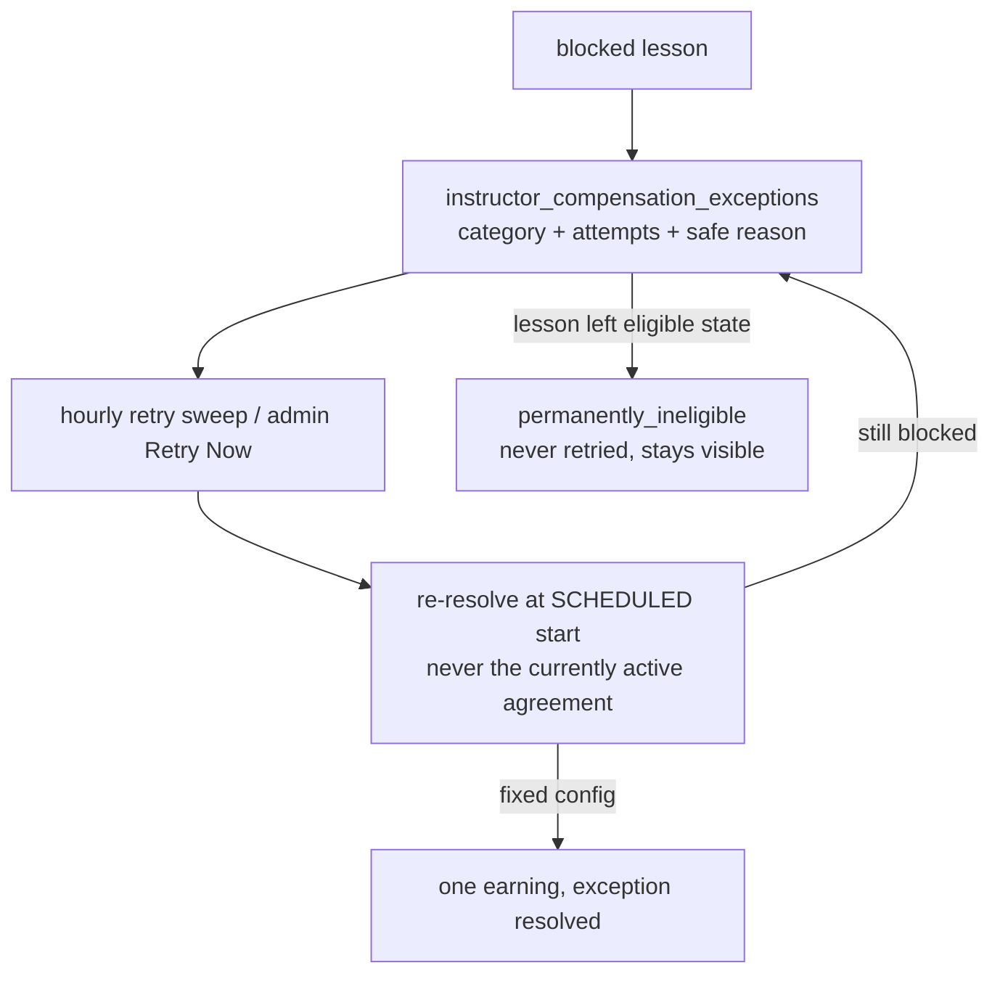
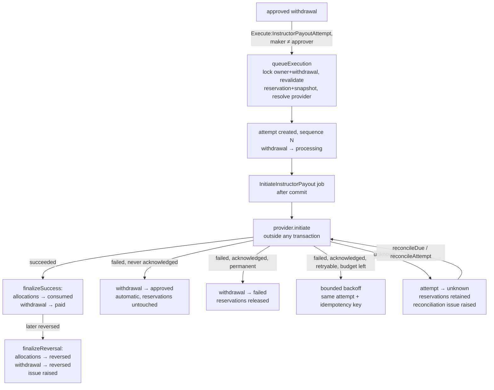

# Financial Domain Architecture (Canonical)

**The single authoritative developer document for the instructor
financial flow** (Phases 14 → 16B, consolidated by the 14.4 cleanup).
The per-phase documents under `docs/architecture/phase-14*` and
`phase-15*` are historical records; where they conflict with this
document, this document wins. Phase 16A's own detailed record is
`docs/phase-16a-payout-execution-reconciliation-foundation.md`; the
unified collection/payout provider-routing audit (Phase 16A.1) is
`docs/payment-collection-and-payout-provider-routing.md` — read that
one for how student payment collection and instructor payouts share an
architectural pattern while staying two separate financial domains.
Phase 16B's own detailed record is
`docs/phase-16b-razorpayx-india-inr-payout-adapter.md` — the RazorpayX
India/INR payout adapter: code-complete, registered, and covered by
real tests, but **not enabled** — see that doc's readiness section for
the exact distinction between code readiness and account/live
readiness.

## 1. Business rules (SRS-derived, non-negotiable)

1. **Instructor compensation is independent of student pricing.** The
   commission model was removed entirely in 14.2/14.4 — no executable
   code multiplies a price by a percentage, no schema column links them,
   and architecture tests fail the build if either returns.
2. Compensation is an **internal administrator decision** captured in
   effective-dated agreements. Experience/qualifications inform the
   admin; they are never a formula.
3. **Historical financial values are immutable** — earnings, snapshots,
   allocations, settlements, and payout snapshots are never
   recalculated, rewritten, or hard-deleted.
4. Every earning, settlement, reservation, and withdrawal is traceable:
   immutable per-row snapshots + `AuditTrailService` entries.
5. **No external money movement has ever occurred.** Phase 16A builds
   the internal payout-execution pipeline end-to-end against a
   deterministic fake provider; Phase 16B adds a real adapter
   (`RazorpayXInstructorPayoutProvider`, India/INR only) that can call
   the live RazorpayX API, but it ships **disabled and uncredentialed**
   — `razorpayx_enabled` defaults false, no key/secret is configured,
   and `payout_execution_enabled` — like the other three switches —
   defaults false and stays false until explicitly authorized. A
   controlled test-mode activation audit (Phase 16B.1) is required
   before any RazorpayX credential is ever entered in production.
6. **Student payment collection and instructor payouts are the same
   architectural pattern (registry → resolver → capabilities →
   eligibility → attempt → reconciliation) applied twice, never one
   shared implementation.** A student's collection provider never
   determines an instructor's payout provider and vice versa (Phase
   16A.1) — see the dedicated routing doc for the full boundary.
7. **Refunds are wallet-first (Phase 16A.1).** Cancelling a paid booking
   credits the student's wallet by default; a direct gateway refund is
   a separately-permissioned exception action, never the default, and
   the two are mutually exclusive per payment.

### Version 1 market strategy — student collection

One real gateway. Razorpay serves every launch market; Stripe is fully
implemented and tested but **deferred**, and no country routes to it.

| Country | Education system | Term | Billing currency | Collection |
|---|---|---|---|---|
| India | IN-SEC | Class | INR | Razorpay domestic |
| United States | US-K12 | Grade | USD | Razorpay International |
| United Kingdom | UK-SEC | Year | GBP | Razorpay International |
| Australia | AU-AC | Year | AUD | Razorpay International |
| Canada | CA-SEC | Grade | CAD | Razorpay International |
| United Arab Emirates | AE-SEC | Grade | AED | Razorpay International |
| Singapore | SG-SEC | Grade | SGD | Razorpay International |
| New Zealand | NZ-NC | Year | NZD | **Blocked** — currency unverified |
| Saudi Arabia | SA-SEC | Grade | SAR | **Blocked** — currency unverified |

**Every other country is inactive** and cannot register, price, book, or
pay.

#### The canonical market source

`Country` owns market identity, and `CountrySeeder::LAUNCH_MARKETS` is
the one place the launch set is declared:

- `Country.status` — is this a market at all? Read by registration
  (`scopeAvailableForRegistration`), pricing, booking, and collection.
  Only launch markets are Active; every other ISO country is seeded
  Inactive and kept purely as reference data.
- `Country.default_currency_id` — the market's billing currency.
- `Country.payment_routing` — which provider serves it, explicitly.
- `CountryEducationSystem` → `EducationSystem` — academics, including
  the student-facing level term (`level_term_singular/plural`), so no
  code branches on country for terminology.

No payment class carries its own country list. Opening a market is a
country row plus pricing rows; closing one is `status = inactive`.

#### Three gates, three different questions

1. **`payment_collection_rollout_scope`** — is collection running at
   all? `active_country_routing` (default) or `disabled`. There is
   deliberately no per-market mode: a single-country scope would put
   market policy in an enum where it drifts from the country data.
   Enforced on the real checkout path by
   `PaymentCollectionEligibilityService`, for bookings and packages
   alike — not merely previewed.
2. **`Country.status` + `Country.payment_routing`** — is this market
   open, and who serves it?
3. **Provider capability** — can this account actually collect this
   currency? `RazorpayPaymentProvider::approvedCurrencies()`.

#### Razorpay capability: domestic vs international

INR is unconditional — domestic collection never depends on the
international attestation, so activating or revoking international
payments can never break India.

International currencies require **both**:

- `razorpay_international_enabled` — an operator's attestation that
  Razorpay approved International Payments on the merchant account, and
- `razorpay_international_currencies` — the specific currencies that
  operator confirmed.

Neither is inferred from credentials. Razorpay publishes no API
reporting international approval, and `rzp_live_*` keys prove nothing: a
domestic-only account holds identical-looking keys and will accept a
foreign-currency order, then decline it at capture, after the student has
entered card details.

The currency list is per-account, not global. Razorpay's own
documentation states that currencies outside their standard set require a
support request, so no static list in this codebase can be authoritative
about a specific merchant. `DEFAULT_INTERNATIONAL_CURRENCIES` seeds the
setting with the six currencies Razorpay's public documentation confirms
(USD, GBP, AUD, CAD, AED, SGD); **NZD and SAR are excluded** because they
could not be verified. Those two markets are academically live and
payment-blocked until an operator confirms them with Razorpay and adds
them to the setting — configuration, not a code change.

#### Merchant settlement is not the customer's transaction

SIRI records what the STUDENT paid. A UK booking is `3900 GBP` on the
attempt, the obligation, and the invoice, and it stays that way forever.

Razorpay settles the Indian merchant account in INR, always, converting
at its own rate on the payment date (their `base_amount` field). That is
a real fact about the business's bank account and a completely different
one from what the customer was charged. This application deliberately
does **not** model it: no FX ledger, no settlement reconciliation, no INR
shadow amount. Rewriting a student's currency to INR because the merchant
was settled in INR would destroy the only record of what they agreed to
pay. If merchant-side FX accounting is needed later it belongs in its own
domain, reading provider settlement reports.

### Refund initiation — operations constraint (Version 1)

Provider refunds must be initiated through the SIRI admin refund
workflow (Finance → Booking Payments → **Refund via Provider**, gated by
`RefundViaProvider:BookingPayment`). Direct refunds issued from the
Razorpay or Stripe dashboard are **not** synchronized into SIRI in
Version 1.

The reason is narrow and deliberate: refund webhooks are not consumed.
`PaymentWebhookEventParser` resolves an attempt from
`payload.payment.entity`, whereas a Razorpay `refund.processed` event
carries `payload.refund.entity`, so the event is acknowledged as
unrecognised and nothing is written. That is the intended Version 1
behaviour — the admin action is synchronous, so there is no outcome for
a webhook to deliver — and there is a test asserting it.

The consequence to brief finance/support staff on: a dashboard-issued
refund moves real money while SIRI still shows the payment as captured,
and the booking, invoice, and student-visible payment history stay
unchanged. Reconciliation will not repair it, because it too only polls
payment status. Refunding through the admin action is what keeps the
two systems in agreement.

`BookingPaymentService::recordRefund()` is the seam a future
`refund.processed` handler would call — it marks the obligation
`provider_refunded_externally` and cancels the booking. It has **no
production caller today** and is deliberately left uncalled rather than
given a synthetic one; it is retained because it is the reconciliation
entry point that closes this gap when dashboard refunds become
operationally supported, and because it already encodes the
transactional pairing (refund + cancel) that such a handler must not
re-derive.

## 2. Complete architecture



## 3. Domain ownership (one owner per fact)

| Domain | Owns | Never does |
|---|---|---|
| Booking/Lesson | scheduling, duration, participants, completion & payment-eligibility facts | calculate compensation, write earnings |
| Compensation | agreement selection/version, overrides, amount, rounding, exceptions, period boundaries | read student price (structurally impossible — the resolver takes only a `Lesson`) |
| Earnings | earning creation, status machine, hold/release, reversal, snapshots, settleable/withdrawable eligibility | move money |
| Settlement | batch lifecycle, earning assignment, totals | create withdrawal allocations |
| Withdrawals | payout methods, balance, reservations, requests, destination snapshots | assign settlement batches |
| Payout execution (`InstructorPayoutExecutionService`) | attempt lifecycle, provider selection, success/failure/reversal finalization, allocation consumption | decide *whether* a withdrawal may be requested (that's Withdrawals) |
| Reconciliation (`InstructorPayoutReconciliationService`) | polling due attempts, raising/resolving issues | apply financial effects outside `applyProviderStatus()` (it reuses the same finalize path as everything else) |

## 4. Lifecycles

**Agreement** `draft → scheduled → active → ended` (+ `cancelled` from
draft/scheduled). One active per instructor (owner lock + generated-
column unique `ica_active_owner_unique`); windows never overlap; active
terms immutable — changes are versioned replacements
(`supersedes_agreement_id`). Periodic bases (daily/weekly/monthly)
cannot activate while `periodic_compensation_enabled` is off.

**Earning** `pending_hold → releasable → settled` with `disputed_hold`
(park/restore), `reversed`, `cancelled`. All transitions via
`InstructorEarningService` + `TransitionInstructorEarningAction`;
`settled`/`reversed`/`cancelled` terminal.

**Settlement batch** `draft → approved → paid` (manual money-moved
record; `processing`/`failed` reserved), `cancelled` from draft/failed
returns earnings to the pool.

**Payout method** `draft → pending_verification → verified → disabled`
(+ rejected→corrected→resubmit). Verified details immutable; disable is
blocked while any active withdrawal depends on the method.

**Withdrawal** `submitted → under_review → approved / rejected /
cancelled`, then the execution segment (Phase 16A, owned exclusively by
`InstructorPayoutExecutionService`): `approved → processing →
paid/failed/reversed`, `processing → approved` (pre-acceptance failure,
automatic), `failed → approved` (explicit authorized recovery — only
reachable when reservations are still intact; a permanent-failure
withdrawal that released its reservations has nothing to recover into
and needs a new withdrawal instead), `paid → reversed`. Rejection/
cancellation releases reservations in the same transaction; approval
re-verifies full integrity and retains them.

**Payout attempt** (Phase 16A) `created → dispatching → {submitted,
acknowledged, processing, succeeded, failed, unknown} → …`. A single
synchronous provider call may report any outcome directly from
`dispatching`. `succeeded → reversed` is the only transition out of a
terminal-looking success. `unknown` only ever resolves through
reconciliation using provider-confirmed evidence — it is never
auto-retried. One row per logical execution; a fresh attempt after a
pre-acceptance failure gets a new `execution_sequence`, never a reused
row.

**Reconciliation issue** (Phase 16A) `open → investigating →
resolved/ignored`. A DB-level generated-column unique key
(`open_dedupe_key`) guarantees at most one open issue per
withdrawal+type even under concurrent reconciliation sweeps. Resolution
requires a mandatory evidence note and only ever closes the issue row —
it can never mark a withdrawal paid.

**Compensation exception** open → (retried) → resolved, or flipped to
`permanently_ineligible` (never retried). One open row per lesson.

### Agreement-to-earning flow



### Settlement vs withdrawal decision



An earning is settleable **or** withdrawal-reserved, never both:
`scopeSettleable` excludes reserved earnings, `scopeWithdrawable`
excludes batch-assigned earnings, and both consumers take the same
locks (below) — proven by real multi-process MySQL races.

### Compensation recovery



### Payout execution (Phase 16A)



## 5. Lock ordering (canonical, deadlock-free by construction)

```text
1. users row of the instructor      ← every financial writer takes this FIRST
2. withdrawal request row
3. payout method / agreement row / payout attempt row
4. instructor earnings, FIFO (released_at, created_at, id)
5. withdrawal allocations
6. settlement batch aggregate / reconciliation issue row
```

Writers that take the owner lock first: withdrawal creation, settlement
drafting, periodic accrual, agreement lifecycle (schedule/activate/
end/cancel/replace), payout-method default/disable, compensation
resolution, payout-execution queueing. Withdrawal transitions lock the
request row then allocations/earnings — same relative order, no cycle.
Payout-execution finalization (success/failure/reversal) locks
withdrawal → attempt → allocations → earnings → (reconciliation issue,
if any) in that order, matching the canonical sequence; the provider
call itself always happens **outside** any open transaction (§18 of the
Phase 16A doc), so a slow/hanging provider call can never hold a
database lock. No retry wrapper exists on purpose: an InnoDB 1213 here
is a lock-order regression, not something to retry — this applies
equally to payout execution; a local deadlock after provider acceptance
is never a reason to re-call the provider. Negative proof executed in
15.1 and 16A: with the locks removed, the race tests fail with
double-spend / duplicate attempts.

## 6. Idempotency

| Operation | Mechanism |
|---|---|
| Lesson earning | unique `lesson_id` + unique `(source_type, source_id)` + idempotent service hit |
| Periodic earning | unique `(agreement_id, period_start, period_end)` + `(source_type, source_id)` |
| Withdrawal submission | server-minted UUID key, payload-bound (altered input = conflict), unique `(instructor_id, idempotency_key)` |
| Withdrawal reference | collision-loop + DB-unique |
| Release sweep / accrual / retry commands | re-runnable; DB constraints make duplicates impossible |
| Exception rows | unique `lesson_id`, updated in place |
| Payout attempt | server-minted UUID idempotency key + keyed HMAC request fingerprint, unique `(withdrawal_request_id, execution_sequence)` and `(provider, idempotency_key)`; a retry reuses the same attempt/key, never mints a new one while the same logical execution is still open |
| Provider event | unique `(provider, provider_event_id)`; a concurrent duplicate is caught by the DB constraint and recorded (not silently dropped, not double-applied) |
| Reconciliation issue | DB-level generated-column unique `open_dedupe_key` — at most one open issue per withdrawal+type, even under a concurrent sweep |

## 7. Money & currency

Integer minor units everywhere; `App\Support\MoneyFormatter` is the
single formatter/parser (exponent from `currencies.minor_units`,
string/integer math, precision rejected not truncated; the wallet
formatter delegates to it). `CompensationMath::hourlyAmount()` is the
single rounding implementation (`half_up_minor`, in every snapshot).
One currency per agreement/earning/withdrawal; allocations
currency-checked both ways; conversion does not exist. Snapshot
currency codes are immutable copies.

## 8. Settings & kill switches (`InstructorEarningSettings`)

`earnings_enabled`, `periodic_compensation_enabled`,
`withdrawals_enabled`, and (Phase 16A) `payout_execution_enabled` all
default **false** and can only change through
**`FinancialFeatureConfigurationService`**: the settings class itself
rejects any other save that flips one of them, every enable operation
runs its activation preflight regardless of caller (Filament merely
relays and displays the typed `FeatureReadiness` result, gated further
by the `Configure:InstructorPayoutExecution` permission for the fourth
switch specifically), and each toggle is audited with the acting admin.
Documented rules: **disabling earnings transactionally auto-disables
periodic compensation**; **disabling payout execution never touches
withdrawals** — withdrawal enablement does not require provider
credentials at all, requests only reserve earnings, independent of
execution readiness (§17 of the Phase 16A doc). Operational settings
(hold/release, settlement minimum + informational frequency, withdrawal
limits/verification/cancellation/review, demo policy,
`compensation_retry_max_attempts`, `payout_provider`,
`payout_maker_checker_enabled`, `payout_auto_retry_enabled`,
`payout_reconciliation_enabled`, `payout_max_attempts`,
`payout_unknown_timeout_minutes`,
`payout_fake_provider_staging_enabled`) save normally, and gating is
still enforced inside the domain services — no command, event, or UI
can bypass a switch. The only test-side bypass is
`Tests\Support\ManagesFinancialSettings` (fixture setup; absent from
production namespaces, architecture-tested).

## 9. Events, listeners, notifications

Domain events (`InstructorEarningCreated/Released`,
`InstructorSettlementPaid`, payout-method + withdrawal lifecycle
events, and Phase 16A's `InstructorPayoutQueued/Submitted/Processing/
Succeeded/Failed/OutcomeUnknown/Reversed` and
`InstructorPayoutReconciliationIssueDetected/Resolved`) dispatch
**after commit** and have no listeners yet — subscription points for
future phases. Notifications ride the `ActivityCreated` pipeline:
services write `AuditTrailService` entries (log names
`instructor_earnings`, `instructor_compensation`, `instructor_payouts`
for anything reflected onto the withdrawal itself — including the
Phase 16A execution segment — and `instructor_payout_execution` for
attempt/reconciliation-only internals); `NotifyAdminsOnActivity` (via
`NotificationMapper`) raises admin alerts (payout method submitted,
withdrawal requested, earning blocked — no agreement, payout failed/
reversed, payout queued, reconciliation issue detected, retry budget
exhausted); `NotifyInstructorOnPayoutActivity` sends instructor
notifications for every withdrawal status including processing/paid/
failed/reversed (queued, `notifications` queue, safe payloads only —
never bank details, provider responses, idempotency keys, or
reconciliation internals). Listener retries are read-only against
financial tables. Direct `activity()` calls are prohibited and
architecture-tested.

## 10. Scheduled commands (all idempotent, `withoutOverlapping`)

| Command | Cadence | Gate |
|---|---|---|
| `instructor-earnings:release` | hourly | `auto_release_enabled` |
| `instructor-earnings:accrue-periodic-compensation` | hourly | `earnings_enabled` + `periodic_compensation_enabled` |
| `instructor-earnings:retry-blocked-lessons` | hourly | `earnings_enabled`; backoff-aware (`next_retry_at`) |
| `instructor-payouts:reconcile` | every 5 min, `onOneServer` | `payout_reconciliation_enabled`; polls attempts due past `payout_unknown_timeout_minutes` |

**Retry backoff (Phase 14.5):** attempt 1 retries at the next sweep,
then +2 h, +6 h, +24 h, then daily, until
`compensation_retry_max_attempts` (default 10) marks the exception
**exhausted** (`retry_exhausted_at`) — excluded from the sweep forever,
still visible in the queue, still manually retryable by admins holding
`Configure:InstructorCompensationAgreement`. Permanent failures never
enter the schedule at all.

**Payout retry (Phase 16A):** automatic retry is gated by
`payout_auto_retry_enabled` (default **off**) and only ever applies to
categories proven safe (`provider_retryable`,
`provider_timeout_before_acceptance`, `provider_unavailable`) — never
to an `unknown` outcome. When on, backoff is `min(60, 5 × attempt)`
minutes up to `payout_max_attempts`; exhaustion audits
`payout_retry_exhausted` and finalizes the attempt as failed through
the same path as any other confirmed failure. Manual retry
(`Retry:InstructorPayoutAttempt`) always requires a reason and bypasses
the delay, never the safety checks (an `unknown` attempt still refuses
manual retry until reconciled).

## 11. Permission matrix (Shield naming, manager via seeders, super-admin bypass)

| Seeder | Grants |
|---|---|
| `InstructorEarningPermissionSeeder` | ViewAny/View/Release/Reverse:InstructorEarning · ViewAny/View/Create/Approve/MarkPaid/Cancel:InstructorSettlementBatch — Update/Delete permissions were **removed** in 14.5: earnings and batches are immutable records; the seeder also deletes the stale rows idempotently |
| `InstructorPayoutPermissionSeeder` | ViewAny/View/ViewSensitive/Verify/Reject/Disable:InstructorPayoutMethod · ViewAny/View/StartReview/Approve/Reject/Cancel:InstructorWithdrawalRequest |
| `InstructorCompensationPermissionSeeder` | ViewAny/View/Create/Schedule/Activate/End/Cancel/ViewHistory/Configure:InstructorCompensationAgreement (exceptions page reuses ViewAny; retry reuses Configure) |
| `InstructorPayoutExecutionPermissionSeeder` (Phase 16A) | ViewAny/View/Execute/Retry/Cancel/Reconcile:InstructorPayoutAttempt · ViewAny/View/Assign/Resolve:InstructorPayoutReconciliationIssue · Configure:InstructorPayoutExecution — no Update/Delete permission exists for either resource (immutable records); no manual mark-paid permission exists anywhere |
| `BookingPaymentPermissionSeeder` (extended, Phase 16A.1) | ViewAny/View:BookingPayment · `RefundViaProvider:BookingPayment` — the separately-permissioned direct-gateway-refund exception action; the normal wallet-credit refund path needs no permission (it is automatic) |
| `RazorpayXPayoutPermissionSeeder` (Phase 16B) | `Configure/TestConnection/ConfirmIpAllowlisting/ProvisionDestination/RefreshDestination/ViewProviderDetails/ProcessWebhook/Reconcile:RazorpayXPayout` — configuration and destination provisioning only; deliberately no Manage/MarkPaid/Delete/Edit/Execute permission. Actual payout execution still requires the existing `Execute:InstructorPayoutAttempt` permission — RazorpayX adds no new way to move money |

Instructor self-service (own payout methods, own withdrawals, own
agreement visibility) is ownership-scoped in policies, permission-free.
**The instructor is never granted any payout-execution permission** —
they cannot queue, execute, retry, cancel, or reconcile their own
payout (invariant #7), and see only safe withdrawal-status fields
(reference, amount, masked destination, dates, safe failure/reversal
messages) — never provider responses, idempotency keys, request
fingerprints, or reconciliation internals.

## 12. Sensitive data

Encrypted at rest (`encrypted:array`, APP_KEY): payout-method details,
withdrawal destination snapshots, and (Phase 16A)
`instructor_payout_attempts.encrypted_provider_metadata` /
`instructor_payout_provider_events.encrypted_payload`. Always `$hidden`:
those payloads, fingerprints, idempotency keys, internal review notes,
agreement internal reasons/notes, earning notes/metadata, and — Phase
16A — a payout attempt's `idempotency_key`, `request_fingerprint`,
`encrypted_provider_metadata`, and `requested_fake_scenario` (a
test/dev-only field that is never fillable, never exposed in any form,
and ignored by any real provider adapter). The provider DTOs
themselves (`PayoutInitiationRequest` et al.) are structurally
forbidden from carrying student price, platform margin, raw Eloquent
models, admin notes, or application secrets — proven by an architecture
test that reflects over the DTO's properties. Decryption happens only
in `viewSensitiveDetails()` (permission `ViewSensitive:…`,
access-audited without values) and withdrawal-approval / payout-
execution integrity checks (the destination is decrypted once, at
provider-call time, from the immutable snapshot — never the live,
mutable payout method). `APP_KEY` operations: back up separately from
DB backups; rotation requires explicit re-encryption via
`APP_PREVIOUS_KEYS`; corrupted payloads fail with safe domain messages.

## 13. Operational activation checklist

1. `php artisan migrate --force`
2. Seed all three permission seeders (deny-by-default policies).
3. Queue worker on `notifications`; scheduler cron running.
4. Create + activate **hourly** agreements for every payable instructor.
5. Clear the Compensation Exceptions queue.
6. Enable `earnings_enabled` (the preflight must pass; it names failing
   instructors otherwise).
7. Verify one real lesson → earning → hold → release cycle.
8. Enable `withdrawals_enabled`; verify method verification → request →
   reservation.
9. `periodic_compensation_enabled` stays off until daily/weekly/monthly
   attendance/leave/partial-period rules are formally defined.
10. Settlement "mark paid" remains a manual money-moved record only —
    unaffected by Phase 16A.
11. Phase 16A payout execution is built (fake provider only) and Phase
    16B adds the RazorpayX India/INR adapter, but `payout_execution_enabled`
    stays off in production until Phase 16B.1's controlled test-mode
    activation audit has run — enabling it today, with `payout_provider`
    still `fake`, would only let the fake provider "execute" payouts,
    which is a testing/staging convenience, never a production path
    (the resolver itself refuses the fake provider outside
    local/testing unless `payout_fake_provider_staging_enabled` is
    explicitly set).
12. To go live with RazorpayX (Phase 16B.1, not yet performed): seed
    `RazorpayXPayoutPermissionSeeder`; configure real credentials,
    account number, and outbound IPs on `RazorpayXPayoutSettingsPage`;
    explicitly confirm IP allowlisting; enable `razorpayx_enabled` +
    both provisioning switches; set `payout_provider` to `razorpayx`;
    verify `evaluatePayoutExecutionReadiness()` passes; then enable
    `payout_execution_enabled` through
    `FinancialFeatureConfigurationService`.

## 13a. Canonical migrations & database rebuild (Phase 14.5, extended in 16A)

The financial schema's baseline lives in **ten consolidated migrations**
(`2026_07_29_1000xx`): agreements → overrides → periods → settlement
batches → earnings → compensation exceptions → payout methods →
withdrawal requests → withdrawal allocations → financial settings.
Phase 16A adds **six further migrations** on top
(`2026_08_01_1000xx`) rather than re-consolidating: payout attempts →
provider events → reconciliation issues → withdrawal-requests execution
columns (`reversed_at`/`reversed_by`/`recovered_*`) →
withdrawal-allocations `reversed_at` → payout-execution settings. Phase
16A.1 adds country-routing columns/settings (`2026_08_05_1000xx`).
Phase 16B adds **two further migrations** (`2026_08_10_1000xx`):
`razorpayx_payout` settings group, and
`instructor_payout_destination_provider_links` (Contact/Fund Account
provisioning state, unique on `(payout_method_id, provider)`, soft
deletes only). This is the normal, expected way schema grows after a
consolidation — only a fresh *pre-production* consolidation event (like
14.5) collapses migration history; ordinary feature work always adds
new migrations.
Every new table encodes its own guarantees directly (generated-column
unique for `open_dedupe_key`, explicit short-named constraints where
the default auto-generated name would exceed MySQL's 64-char identifier
limit, CHECK constraints, restrictive FKs, switch default OFF). Fresh
install: `php artisan migrate --force` + all four permission seeders.
Disposable dev rebuild: `php artisan migrate:fresh --force` (dev/testing
only).

## 13b. Phase 16A handoff — fulfilled

The Phase 14.5 handoff note asked for: consuming **approved** withdrawal
requests via `approved → processing → paid/failed` (Phase 16A adds
`reversed` and the pre-acceptance `processing → approved` auto-return);
paying from the **encrypted snapshot**, never the live payout method
(§16A confirmed: the destination is decrypted once, at provider-call
time, from `encrypted_payout_method_snapshot`); provider credentials/
webhooks/reconciliation without touching any Phase ≤15 invariant (the
fake provider needs no credentials, and the withdrawal/allocation/
settlement invariants are unchanged plus one deliberate widening — see
below); keeping `withdrawals_enabled` independent of execution readiness
(confirmed — `evaluateWithdrawalReadiness()` never checks
`payout_execution_enabled`).

One handoff assumption was **corrected** during implementation, not
followed literally: converting earnings to `settled` on payout success.
Doing so would have made `InstructorEarning::status` terminal at
`Settled` (its own transition matrix allows no way out), which is
incompatible with a later reversal needing the earning to become
available again. Phase 16A instead leaves `InstructorEarning.status`
entirely untouched by the withdrawal/payout pipeline — exactly as it
already worked for `Reserved` allocations — and lets the
**allocation's own status** (`reserved → consumed → reversed`) be the
sole source of truth for "is this earning's money currently committed,
and how." `scopeSettleable()` was extended to also exclude `Consumed`
allocations (previously only `Reserved`), closing the one gap this
created: a partially/fully consumed earning can no longer be
settlement-batched, preserving invariant #17 (settlement and payout
execution never consume the same earning amount).

## 13c. Phase 16B handoff — fulfilled

The Phase 16A handoff note asked for a real provider adapter that:
implements `InstructorPayoutProviderInterface` (never reusing
`Booking\Contracts\PaymentProviderInterface`); registers in
`EarningServiceProvider`; centralizes its own provider-status →
`InstructorPayoutAttemptStatus` mapping inside the adapter; adds a
signed public webhook endpoint that normalizes into
`NormalizedPayoutEvent` and calls the existing
`InstructorPayoutExecutionService::handleNormalizedEvent()`; supplies
credentials via a dedicated settings path; and passes the same
fake-provider-proven test suite pattern. `RazorpayXInstructorPayoutProvider`
(India/INR only) does all of this — see
`docs/phase-16b-razorpayx-india-inr-payout-adapter.md` for the full
record: Contact→Fund Account provisioning
(`InstructorPayoutDestinationProviderLink`), the
`X-Payout-Idempotency`-header payout creation path, raw-body HMAC
webhook verification with secret rotation support, RazorpayX-specific
failure categories and reconciliation issue types, and a dedicated
`RazorpayXPayoutSettingsPage`.

**Two things are deliberately still open, by design, not oversight:**
`payout_execution_enabled` and `razorpayx_enabled` both remain **off**
— Phase 16B is a code/adapter phase, never a production-activation
phase — and Phase 16B.1 (a controlled test-mode activation audit) must
run before any RazorpayX credential is entered anywhere but a local/CI
environment.

## 14. Troubleshooting

| Symptom | Look at |
|---|---|
| Lesson completed, no earning | Compensation Exceptions page — category tells you why; fix config, retry resolves at the lesson's scheduled start |
| "Earnings cannot be enabled yet" | The preflight notification lists exact failing instructors/checks |
| Balance lower than expected | Reserved allocations (live withdrawal) or batch assignment — both visible on the earning row |
| Periodic agreement not paying | `periodic_compensation_enabled` + agreement status + accrual log (`storage/logs/instructor-earnings-accrual.log`) |
| Payout method can't be disabled | An active withdrawal references it — resolve the withdrawal first (by design) |
| InnoDB 1213 in financial code | Lock-order regression — see §5; do **not** add a retry wrapper |
| Withdrawal stuck in `processing` | Check its payout attempt's status — `unknown` means reconciliation hasn't resolved it yet; run `instructor-payouts:reconcile` or the attempt's "Reconcile Now" action |
| "Payout execution cannot be enabled yet" | `evaluatePayoutExecutionReadiness()->summary()` on the settings page lists the exact failing check (provider unhealthy, missing constraint, critical open issue, etc.) |
| Reconciliation issue won't go away | Open issues dedupe per withdrawal+type — resolving requires a mandatory evidence note; resolving never marks anything paid, so a still-uncertain payout needs the underlying attempt fixed first |
| Payout attempt failed but withdrawal is still `approved` | Expected for a pre-acceptance failure (provider never confirmed receipt) — a fresh execution can be queued immediately, no recovery action needed |
| Payout attempt failed and withdrawal is `failed` | The provider confirmed the failure. If permanent (destination invalid), reservations were released — the instructor needs a new withdrawal. If retryable/exhausted, reservations are intact — use the manual retry action (which performs the `failed → approved` recovery) |
| RazorpayX payout method stuck "Not provisioned" | Contact/Fund Account provisioning switches (`RazorpayXPayoutSettingsPage`) may be off, or the "Provision" action hasn't been run yet — see `docs/phase-16b-razorpayx-india-inr-payout-adapter.md` |
| RazorpayX provider link shows `contact_unknown`/`fund_account_unknown` | A provisioning call may have reached RazorpayX before it timed out — use "Refresh" (never re-run "Provision", which only starts a fresh link) |
| RazorpayX webhook returns 401 | Signature verification failed — check `razorpayx_webhook_secret` matches the RazorpayX dashboard exactly, and that a rotation didn't clear the previous secret too early |

## 15. Deferred

Both provider integrations (RazorpayX instructor payouts, Stripe
international collection) are **code-complete and account-unverified**
as of Phase 16C/16D — see `docs/financial-provider-activation-handoff.md`
for the canonical current status and exact resume prerequisites for
each. Deferred pending those external prerequisites: Phase 16B.1
(controlled RazorpayX test-mode activation audit — real sandbox
credentials, a genuine test-mode payout, verified webhook delivery);
Phase 16C.1 (controlled Stripe test-mode activation audit — real Stripe
test credentials, a genuine test-mode checkout, verified webhook
delivery) — both before any production credential is entered.

Also still deferred, independent of provider activation: international
instructor payouts (RazorpayX is India/INR only by design); Razorpay
International as a verified collection fallback; RazorpayX tax/TDS
withholding (fees/tax are recorded as platform operational cost, never
deducted from the instructor); withdrawal fees (schema-ready); currency
conversion (explicitly never — both domains are single-currency-per-
transaction by design); wallet recharge and wallet-as-payment-method;
`payu`/`phonepe`/`cashfree`/`paypal` real collection adapters
(settings-only, no implementation); incentive & adjustment earning
sources; automatic tiers; demo-to-paid/hybrid demo policies;
withdrawal↔settlement-batch linkage; bulk payout uploads; accounting
exports; an emergency maker-checker bypass (deliberately not built in
16A — see its own doc §6).
