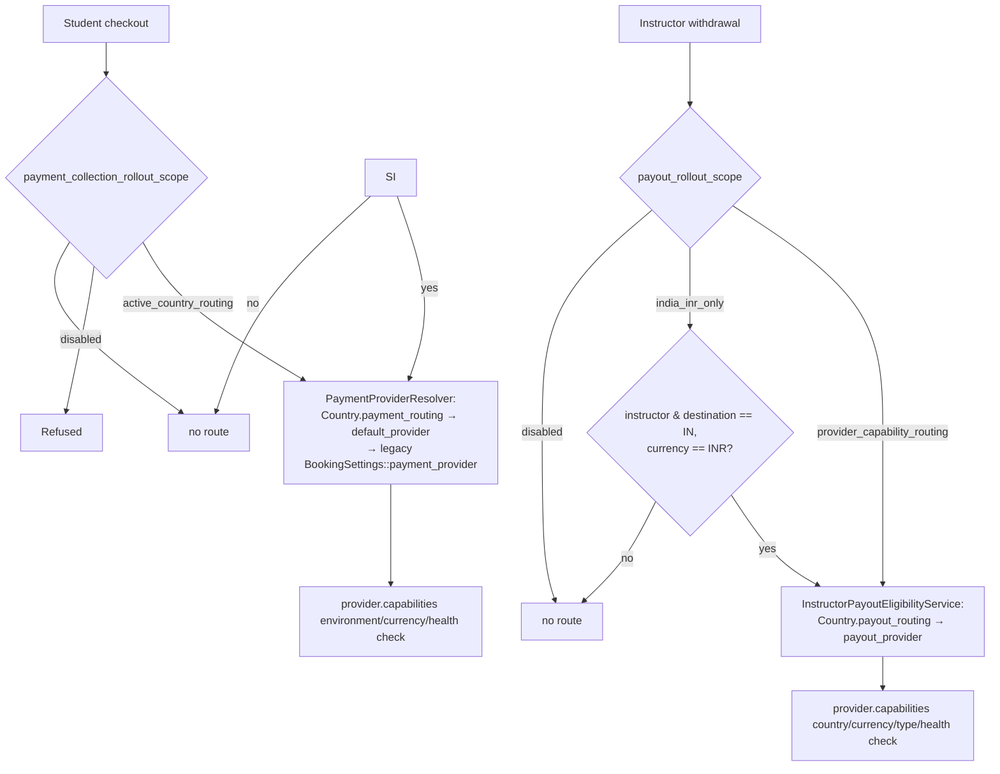
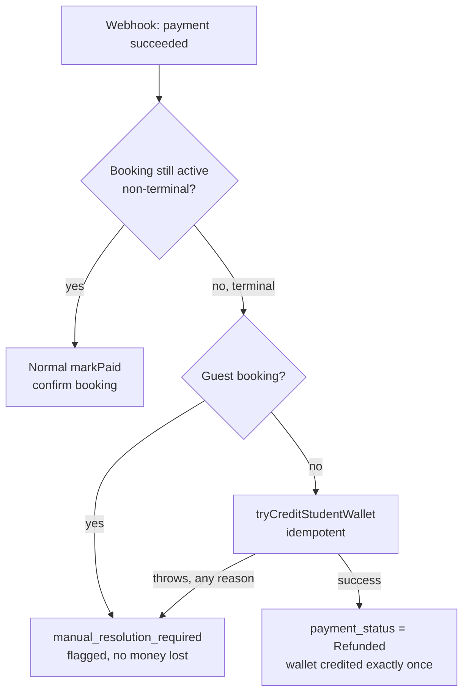
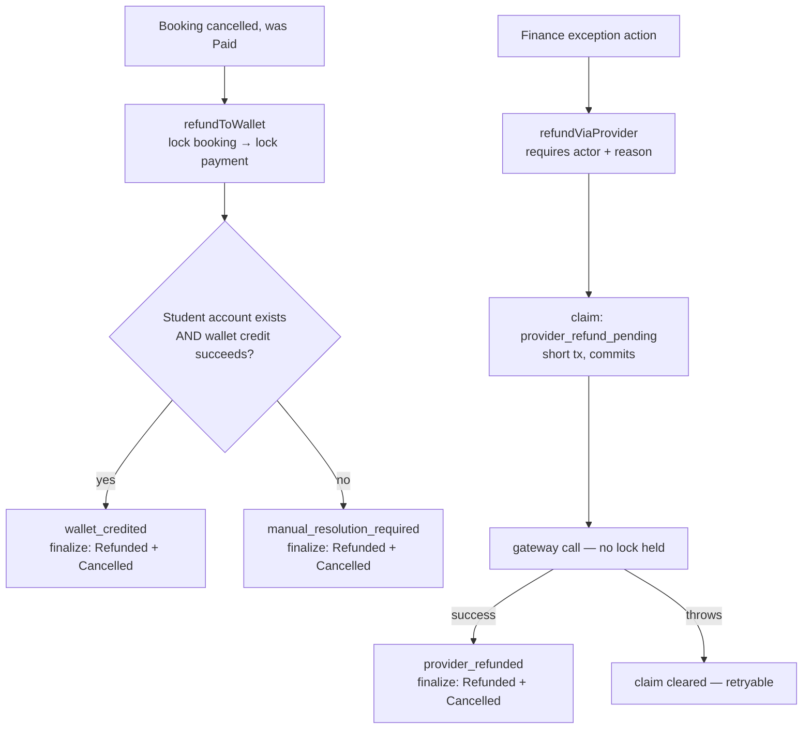

# Payment Collection & Instructor Payout Provider Routing (Phase 16A.1)

The canonical, always-current reference for the wider financial domain
is [docs/financial-domain-architecture.md](financial-domain-architecture.md).
This document is the detailed Phase 16A.1 record: an audit-first pass
proving student payment collection and instructor payouts share one
architectural pattern while remaining two genuinely separate financial
domains, plus the hardening it surfaced along the way (a wallet-first
refund policy, two real webhook-safety fixes, and a provider-neutral
routing/eligibility layer for both sides).

## 1. Incoming vs. outgoing money

Collection (student → platform) and payout (platform → instructor) are
opposite-direction, opposite-risk-profile flows that happen to share a
shape of problem — "which provider, if any, may handle this
transaction right now" — never a shape of *state*. Money that never
left the platform (collection) and money that is about to leave it
(payout) cannot be governed by the same lifecycle, the same contract,
or the same transaction model without one side's incident becoming the
other's.

## 2. Why provider contracts stay separate

`PaymentProviderInterface` (collection) and
`InstructorPayoutProviderInterface` (payout) are structurally unrelated
types (`is_a()` false in both directions — architecture-tested).
Collection semantics: create an order/intent, checkout, capture,
verify, credit a wallet or confirm a booking, refund. Payout semantics:
validate a destination, initiate a transfer, track processing → paid/
failed, reverse, consume a reservation. No method on one interface maps
cleanly onto the other, and forcing a shared `FinancialProviderInterface`
would immediately create a caller that doesn't know or care which
direction its money is moving — exactly the ambiguity this phase
closes off (architecture-tested: no such interface may exist).

## 3. The shared architectural pattern

Both domains now expose the same six concepts, as two independent
implementations:

| Concept | Collection | Payout |
|---|---|---|
| Provider contract | `PaymentProviderInterface` | `InstructorPayoutProviderInterface` |
| Registry | `PaymentProviderRegistry` | `InstructorPayoutProviderRegistry` |
| Resolver | `PaymentProviderResolver` | `InstructorPayoutProviderResolver` |
| Capabilities | `PaymentProviderCapabilities` | `PayoutProviderCapabilities` |
| Eligibility | `PaymentCollectionEligibilityService` | `InstructorPayoutEligibilityService` |
| Attempt | `BookingPayment` | `InstructorPayoutAttempt` |
| Provider event | (foundation only — see §19) | `InstructorPayoutProviderEvent` |
| Reconciliation | *(not built this phase — see §25)* | `InstructorPayoutReconciliationIssue` |

Genuinely shared infrastructure (not domain state) lives once:
`App\Support\MoneyFormatter`, the keyed-HMAC fingerprint pattern (each
domain has its own concrete service — `PayoutRequestFingerprintService`
— but the *technique* is shared knowledge, not shared code), the
real-MySQL concurrency test harness (`tests/Concurrency/run-op.php`),
and the `AuditTrailService`/`ActivityCreated` notification pipeline.

## 4. Collection capability & eligibility model

`PaymentProviderCapabilities` (a provider's static, declared shape —
never a network call) exposes: supported student countries/billing
currencies/collection currencies/transaction types/payment methods,
wallet-recharge and direct-booking-payment support, status-fetch/
webhook/refund/partial-refund/async-confirmation/idempotency support,
customer-creation/return-URL/webhook-signature requirements, health,
and a capability version. Every registered provider
(`FakePaymentProvider`, `RazorpayPaymentProvider`,
`StripePaymentProvider`) implements `capabilities()`; nothing in the
generic booking domain branches on a provider name.

`PaymentCollectionEligibilityService::resolve(studentCountry,
billingCurrency, transactionType, paymentMethod)` is a read-only
preview: it never initiates a payment. It layers `payment_
collection_rollout_scope` (§8) over the *existing, already-tested*
`PaymentProviderResolver` routing order (`Country::payment_routing` →
`default_provider` → legacy `BookingSettings::payment_provider`), then
checks the resolved provider's capabilities, returning a typed
`PaymentEligibilityResult` (`is_eligible`, `blocking_codes`,
`safe_messages`, …) — never a raw exception.

## 5. Payout capability & eligibility model

`PayoutProviderCapabilities` mirrors §4's shape for the outbound side:
supported instructor/destination countries, currencies, destination
types (`PayoutMethodType`), transfer modes, and the same support/
requirement/health/version fields. `FakeInstructorPayoutProvider`
implements `capabilities()` deliberately unrestricted (it exists to
prove routing works, not to simulate a real provider's actual
approvals).

`InstructorPayoutEligibilityService::resolve(instructorCountry,
destinationCountry, withdrawalCurrency, destinationType)` layers
`payout_rollout_scope` (§8) over `Country.payout_routing` (a *new*,
deliberately separate JSON column from `payment_routing` — see §8) and
`InstructorEarningSettings::payout_provider`, then checks capabilities.
Distinct on purpose from `App\Earnings\Support\InstructorPayoutEligibility`
(Phase 15), which answers a different question — "is this user's
*account* allowed to hold payout methods at all" — with no notion of
provider or geography.

## 6. Country/currency routing



Both resolutions are deterministic and read-only; the *actual*
provider used for a real attempt is recorded on the immutable attempt
row itself (`BookingPayment.provider`, `InstructorPayoutAttempt.provider`)
— never re-derived later.

## 7. India/INR collection strategy

`RazorpayPaymentProvider::capabilities()` declares `supportedStudentCountries
= ['IN']`, `supportedBillingCurrencies = ['INR']`. This is the only
collection provider with a complete, tested, end-to-end flow (order
creation → checkout signature verification → webhook capture, all
audited in `tests/Feature/Booking/RazorpayCheckoutTest.php`).
`payment_collection_rollout_scope` defaults to `active_country_routing`,
matching this reality exactly — not aspirational configuration.

## 8. US/UK (international) collection strategy

`StripePaymentProvider::capabilities()` declares
`supportedBillingCurrencies = ['USD', 'GBP', 'EUR', 'AED']` (INR is
deliberately excluded — reserved for Razorpay by routing convention).
Its own docblock is explicit: *"Frontend Stripe.js/Elements integration
is not built in this phase… this class is the complete, tested backend
half."* Accordingly `capabilities()` declares
`supportedStudentCountries = []` (nothing verified yet, so nothing is
asserted) rather than guessing. Moving `payment_collection_rollout_scope`
to `active_country_routing` should wait for that frontend
integration and a verified live Stripe account — this phase leaves the
switch at the current safe value and documents the blocker instead of
flipping it.

### 8.1 Multi-currency collection is live via Razorpay (2026-08-29)

The Stripe blocker above is no longer the thing standing between the
platform and international collection — Razorpay is. Nine markets
(IN/US/GB/CA/AU/AE/SG/NZ/SA) now collect in their own currency through
`razorpay_international_enabled` + `razorpay_international_currencies`.

Two defects were closed to get there:

1. **The attestation had no UI.** `razorpay_international_enabled` was
   added by `2026_11_04_100000` defaulting to false, designed as an
   operator attestation — but no admin screen ever exposed it, so it
   could only ever BE false. `approvedCurrencies()` therefore collapsed
   to `['INR']` and every non-INR market was refused at checkout with
   "This provider does not support AUD", no matter how the country,
   currency and price matrix were configured. Fixed by the
   "International Collection" section on
   `PaymentSettingsPage::razorpayInternationalSection()`, whose
   currency options read active `Currency` rows rather than a hardcoded
   list — so NZD and SAR, excluded even from the seeded default, are
   selectable.

2. **The market gate described in §6 was not actually closed.** All 196
   seeded countries were `active` and NOT ONE carried
   `payment_routing`, contradicting `2026_11_05_100000`'s own claim
   that "every launch market carries an explicit `payment_routing`
   entry". Every country fell through to `default_provider`; the only
   thing stopping an unlaunched market was the incidental absence of a
   `StudentLessonPrice` row, so those students failed at PRICING rather
   than at the gate. Closed by
   `2026_08_29_120000_restrict_active_countries_to_launch_markets`.

**Drift is now visible rather than latent.** The same settings section
renders a live Market Coverage readout naming any launched country
whose currency is not attested — the failure in (1) reported from the
screen that can fix it, instead of from a student's checkout.

**Open: `countries.status` is overloaded.** It gates the market AND
backs reference-data surfaces that have nothing to do with where the
platform sells — `PhoneNumberService::normalize()` rejects a number
whose country is inactive, and `user_educations`, `user_experiences`
and `instructor_payout_methods` all pick from active countries. With
187 countries now inactive, a person outside the nine cannot save a
phone number, record a foreign degree, or add a payout bank account in
their own country. Correct for students, who must be in a launch market
anyway; **wrong for instructors**, who are routinely resident
elsewhere, and the first non-launch-market instructor onboarding will
hit it. The fix is to split "is a market" from "is a known country" —
deliberately not attempted alongside a data migration.

## 9. Razorpay International fallback rules

Not implemented as live routing this phase (no verified Razorpay
International account/capability exists), but the **safe-fallback
rule** that will govern it is already the platform-wide rule (§13):
fallback is only permitted *before* a request may have been accepted
by the primary provider — disabled/misconfigured/unhealthy primary,
unsupported currency, or an explicit pre-acceptance rejection.
Never after a timeout, an unknown acceptance, or any state where a
duplicate charge is possible.

## 10. India/INR payout strategy

`payout_rollout_scope` defaults to `india_inr_only`, matching the
policy the Phase 16B RazorpayX adapter was built against.
`RazorpayXInstructorPayoutProvider` is now registered (Phase 16B), but
`InstructorEarningSettings::payout_provider` still defaults to `fake`
— an India/INR route resolves against `fake` today unless an admin
explicitly changes `payout_provider` to `razorpayx` *and* completes
RazorpayX configuration, provisioning, and IP-allowlisting
confirmation (`docs/phase-16b-razorpayx-india-inr-payout-adapter.md`).
The architecture guarantee changed shape accordingly: it used to be
"the payout registry never resolves `razorpayx`" (no adapter existed);
it is now "`razorpayx` is registered but `razorpayx_enabled` defaults
false and no credential is configured, so `InstructorPayoutProviderResolver::resolve('razorpayx', …)`
still fails its health check by default" — see
`FinancialArchitectureTest::test_only_fake_and_razorpayx_payout_providers_are_registered()`.

## 11. Unsupported international payout behavior

A non-India instructor, or a non-INR withdrawal, finds no eligible
route under `india_inr_only` and `InstructorPayoutEligibilityService`
returns `is_eligible = false` with `country_route_missing`. Per §24,
this must never hide the instructor's earnings history — only block
withdrawal *execution* — and must never silently pick a provider that
wasn't explicitly verified for that geography.

## 12. Booking price snapshots

Confirmed already correct, unchanged by this phase:
`BookingPriceCalculator::calculate()` is the single source of truth,
called once inside `BookingService::create()` and stored immutably on
`bookings.price`/`bookings.currency` *before* any checkout begins.
Paid-type pricing resolves exclusively through
`StudentLessonPriceResolver` against the admin-managed
`StudentLessonPrice` matrix (subject + level + country + duration,
instructor-override-aware); a paid type with no matching row throws
rather than defaulting to free. Payment creation
(`BookingPaymentService::initiate()`) uses this snapshot — it never
re-resolves the current price after checkout begins. Contains no
instructor compensation field (architecture-tested).

## 13. Booking payment lifecycle

`BookingPaymentRecordStatus`: `Pending → Authorized → Captured →
{Failed, Cancelled, Expired, Refunded}` (audit note: this class's
`isTerminal()` docblock read backwards relative to what the method
actually returns — a pre-existing documentation bug, fixed as part of
this pass). `BookingPaymentStatus` (booking-level, deliberately a
*separate* enum — never forced to share one status machine with the
attempt-level record): `NotRequired, Pending, Paid, Failed, Refunded`.
The fake provider now creates (and, on webhook success, captures) its
own `BookingPayment` row too (previously it created none at all) —
needed so a fake-provider booking's cancellation refund has the same
captured row every real adapter already produces to resolve against;
`tests/Feature/Booking/RazorpayCheckoutTest.php`'s and
`StripeCheckoutTest.php`'s "fake provider flow is unaffected by
{gateway} registration" tests were updated to assert the new (correct)
row, not its prior absence.

## 14. Wallet recharge lifecycle

Audited, unchanged, and explicitly out of this phase's scope to build:
`WalletLedgerEntryType::RechargePending`/`RechargeConfirmed` exist as
enum cases with **zero call sites** anywhere in the codebase — no
recharge controller/service exists yet (`WalletOverview`'s own
docblock: *"Recharge is a disabled 'coming soon' button, never a
Razorpay call"*). Likewise a wallet debit never confirms a booking
today (`BookingHold`/`BookingHoldRelease` ledger types are defined,
unused). These remain accurately documented as **not built**, not
silently assumed.

## 15. Late-success resolution ("Option B")

Audited and found **already correct** against this phase's required
policy — no change needed. `BookingPaymentService::handleLateTerminalPayment()`:
a genuine, signature-verified gateway success arriving after the
booking has already gone terminal (cancelled/expired/completed/
no-show) is never silently dropped, never force-confirms a dead
booking, and never double-credits. For a student booking: credited to
their wallet (`WalletLedgerEntryType::LatePaymentCredit`, idempotency
key `late-payment-credit:{payment_id}:{provider_payment_id|reference}`),
`payment_status` becomes `Refunded` only if the credit actually
succeeds. For a guest booking, or if the wallet credit throws for any
reason, the payment is flagged `manual_resolution_required` in
`metadata` — never a 500, never silent loss.



## 16. Refund policy (Version 1 — implemented this phase)

**Changed behavior.** Previously, cancelling a paid booking called the
real gateway refund API directly
(`SyncPaymentOnCancellation` → the old `refund()` → provider call →
`recordRefund()`). This phase replaces that with a wallet-first policy:

- **`BookingPaymentServiceInterface::refundToWallet()`** — the new
  default. Locks the booking (the serialization point shared with the
  exception path below), credits the student's wallet in the payment's
  original currency (`WalletLedgerEntryType::Refund`, idempotency key
  `cancellation-refund:{payment_id}`), and finalizes in the *same*
  transaction — no external call, so no lock-vs-network conflict.
  `SyncPaymentOnCancellation` always calls this now. A guest booking
  (no wallet-holding account) or a wallet-credit failure for any reason
  falls back to `manual_resolution_required` (same pattern as §15) —
  the booking still gets cancelled/refunded-status, but money movement
  waits for a human.
- **`BookingPaymentServiceInterface::refundViaProvider()`** — the
  exception path. Requires the acting `User` and a mandatory reason.
  Reserved for a duplicate charge, a payment collected without a valid
  obligation, a compliance/legal requirement, or a finance-admin
  correction — never the default. Gated by the new
  `RefundViaProvider:BookingPayment` permission (Filament: "Refund via
  Provider" record action on the read-only Booking Payments resource).
  Follows the same claim → call-outside-transaction → finalize pattern
  as instructor payout execution (§26): a short transaction tags the
  payment `provider_refund_pending`, the gateway call happens with no
  lock held, and on failure the tag is cleared so a retry (or the
  wallet path) is not permanently locked out.
- **`recordRefund()`** — unchanged in spirit: synchronizes local state
  for a refund that already happened provider-side (e.g. a
  dashboard-initiated refund reported via webhook). No money moves
  here.

`BookingPayment.metadata['refund_resolution']` (`wallet_credited` |
`provider_refund_pending` | `provider_refunded` |
`provider_refunded_externally` | `manual_resolution_required`) is the
mutual-exclusion guard: exactly one of these is ever set per payment,
enforced under a row lock, proven by a real two-process race
(`tests/Feature/Booking/Concurrency/BookingRefundConcurrencyTest.php`,
3 consecutive green runs) that fires `refundToWallet()` and
`refundViaProvider()` at the same booking simultaneously — exactly one
wins, the payment is resolved exactly once, no double-credit is
possible.



## 17. Provider fallback safety

The platform-wide rule (§9 of this doc) is unchanged by this phase and
already enforced structurally: `PaymentProviderResolver`/
`InstructorPayoutProviderResolver` only ever select a provider *before*
any request is sent (safe to swap); once `execute()`/`initiate()` has
been called, both domains keep the same attempt, the same idempotency
key, and reconcile rather than re-select (Phase 16A §9, applied
identically here).

## 18. Evidence precedence

Both domains already follow the same order in spirit — authenticated
provider webhook/status-fetch outranks a browser-reported outcome,
which outranks a local timeout — though this phase does not introduce
a single shared "evidence" abstraction (the two domains' verification
code remains intentionally separate; see §17 of the Phase 16A doc for
the payout side's `PayoutStatusResult`/`NormalizedPayoutEvent`
precedence, and `RazorpayPaymentProvider`/`StripePaymentProvider`'s
`verifyCheckout()` vs. `parseWebhook()` split for the collection side —
webhook is documented as "the authoritative fallback" over the
client-side checkout-signature path).

## 19. Webhook separation & the two fixes

Collection and payout webhooks were already fully separate (different
routes, different processors, different event models — no shared
route exists, architecture-tested). Auditing the collection side
surfaced two real gaps, both fixed this phase:

1. **Unsigned webhook accepted when no secret configured.**
   `PaymentWebhookSignatureService::isValid()` returned `true`
   unconditionally when a gateway's webhook secret was blank ("safe
   default for setup phase"). This is the *generic* webhook path
   (`api/webhooks/payments/{gateway}`), which today only logs/audits
   (see #2) — so the practical blast radius was contained — but it is
   still a fail-open default that becomes dangerous the moment anyone
   wires real settlement into that hook point, which its own code
   comment invites (`// Hook point: domain-specific payment
   reconciliation can be added here`). **Fixed**: a blank secret now
   fails *closed* for every gateway this service actually knows how to
   verify (stripe/razorpay/cashfree); only a gateway with no
   verification implemented at all (payu, phonepe — no adapter exists
   — and manual, which by definition has no signature) still passes
   unsigned, and that is now an explicit, named exception rather than
   an accidental blanket default.
2. **Default webhook URL pointed at the wrong route.** The admin
   "Copy Webhook URL" action's default value for Stripe and Razorpay —
   the *only* two gateways with a real `PaymentProviderInterface`
   adapter and a working settlement route
   (`api/webhooks/bookings/payments/{provider}`) — pointed at
   `api/webhooks/payments/{gateway}` instead: the generic path that
   only logs/audits and **never settles a booking payment or credits a
   wallet** (confirmed by `PaymentWebhookProcessor`'s own code and its
   dedicated test, `tests/Unit/Services/PaymentWebhookProcessorTest.php`).
   An admin who configured their real Razorpay/Stripe dashboard using
   the suggested default would have every asynchronous webhook
   (delayed confirmations, refunds, failures) silently swallowed —
   only the synchronous checkout-time path would ever have worked.
   **Fixed**: the Stripe/Razorpay defaults now point at the real
   settlement route. paypal/cashfree/payu/phonepe/manual keep their
   existing defaults unchanged — they have no registered adapter at
   all, so the settlement route would 404 for them regardless; there
   is genuinely nowhere else to point them yet.

## 20. Reconciliation

The payout side has a full reconciliation subsystem
(`InstructorPayoutReconciliationIssue`/`-Service`, Phase 16A §13). The
collection side has **no equivalent model this phase** — confirmed by
audit (`grep` for "reconcil" only surfaces the payout domain and one
dangling code comment). This is a deliberate scope boundary, not an
oversight: collection settlement is webhook/callback-driven with
synchronous provider verification already built in
(`verifyCheckout()`), so the "poll an uncertain outcome" pattern that
motivates payout reconciliation does not have the same shape on the
collection side today. Building a `PaymentReconciliationIssue` model is
listed as deferred work (§25) rather than attempted here, to avoid
scope creep past "routing audit and hardening" into a second full
reconciliation subsystem in one phase.

## 21. Lock ordering

**Collection** (new, Phase 16A.1 — the refund paths are the first
collection-side code to take locks in a documented order):

```text
1. Booking row (lockedPaidBooking — the serialization point)
2. BookingPayment row (lockedUnresolvedCapturedPayment)
3. Wallet row (WalletLedgerService's own locking, for refundToWallet only)
```

The gateway call in `refundViaProvider()` always happens *outside* any
open transaction — claim (short tx) → call (no lock) → finalize (short
tx) — the exact pattern Phase 16A established for payout execution.

**Payout** (unchanged from Phase 16A §15):

```text
1. Instructor/user financial owner row
2. Withdrawal request
3. Payout attempt
4. Withdrawal allocations
5. Instructor earnings, deterministic order
6. Reconciliation issue
```

No cross-flow transaction ever locks a student-side row and an
instructor-side row together — the two lock orders never need to
interleave because no code path holds both at once.

## 22. Idempotency

Collection: `BookingPayment.idempotency_key` (unique per booking,
existing), `refundToWallet()`'s wallet-ledger idempotency key
(`cancellation-refund:{payment_id}`), and the late-success credit key
(`late-payment-credit:{payment_id}:{provider_payment_id|reference}`) —
all backstopped by `wallet_ledger_entries.idempotency_key`'s DB-level
unique constraint (confirmed by audit), so a concurrent retry can never
double-credit regardless of application-level races.
Payout: unchanged from Phase 16A §7 — server-minted UUID attempt keys,
never caller-supplied. The two domains' idempotency keyspaces never
overlap (different prefixes, different tables, different unique
constraints) — a collision is not just unlikely, it is structurally
impossible.

## 23. Permissions

New this phase: `RefundViaProvider:BookingPayment` (§16) — the only
mutation permission `BookingPaymentPermissionSeeder` grants; the
resource otherwise remains strictly read-only (no Create/Update/Delete,
confirmed unchanged). Payout permissions are unchanged from Phase 16A
§17 (`InstructorPayoutExecutionPermissionSeeder`). No new payout
permission was added for the routing/eligibility layer itself — both
`resolve()` methods are read-only previews with no side effects, so
they need no permission of their own (any caller may ask "is this
route eligible," the same way anyone may ask "what does this cost").

## 24. Activation checklist (routing-specific additions)

On top of the Phase 16A checklist (unchanged): before moving
`payment_collection_rollout_scope` to `active_country_routing`,
confirm (a) a verified live Stripe account and (b) the frontend Stripe.js/
Elements integration exists (§8) — neither exists yet. Before moving
`payout_rollout_scope` to `provider_capability_routing`, confirm a real
payout provider adapter exists and is verified for the target
geography (Phase 16B+). Both rollout-scope settings are policy, not
kill switches — flipping them alone enables nothing; `payments_enabled`
and `payout_execution_enabled` remain the authoritative gates.

## 25. Deferred (Phase 16B.1+ and beyond)

> **Superseded notice (Phase 16D):** this section is a historical
> record of what Phase 16A.1 left deferred and is not rewritten here.
> Two items below are no longer accurate: the Stripe frontend
> Stripe.js/Elements integration and the collection-side
> `PaymentReconciliationIssue` model/service were both built in Phase
> 16C (see `docs/phase-16b-razorpayx-india-inr-payout-adapter.md`'s
> sibling — no dedicated Phase 16C doc exists; see
> `docs/financial-provider-activation-handoff.md` for the current,
> canonical status of both provider integrations). Both remain
> code-complete but **account-unverified** — no real Stripe or
> RazorpayX credential has ever been used. Everything else below is
> still accurate.

Phase 16B (RazorpayX India/INR payout adapter) is now built — see
`docs/phase-16b-razorpayx-india-inr-payout-adapter.md` — but its
production activation (Phase 16B.1: a controlled test-mode audit with
real sandbox credentials) has not run, and `payout_provider` still
defaults to `fake`. Still deferred: a real, verified Stripe
International collection account plus its frontend Stripe.js/Elements
integration (Phase 16C, now built at the code level — see the
superseded notice above); Razorpay International as a verified fallback
provider; international instructor payouts (RazorpayX is India/INR
only by design); a `PaymentReconciliationIssue` model/service for the
collection side (§20, now built at the code level — see the superseded
notice above); wallet recharge and wallet-as-payment-method
(§14) — both remain intentionally unbuilt, enum-ready only;
`payu`/`phonepe`/`cashfree`/`paypal` real adapters (currently
settings-only, no `PaymentProviderInterface` implementation for any of
them — a pre-existing gap this audit surfaced but did not attempt to
close, since building four more real gateway integrations is well
outside "routing audit and hardening"); currency conversion
(explicitly never — both domains are single-currency-per-transaction
by design).
