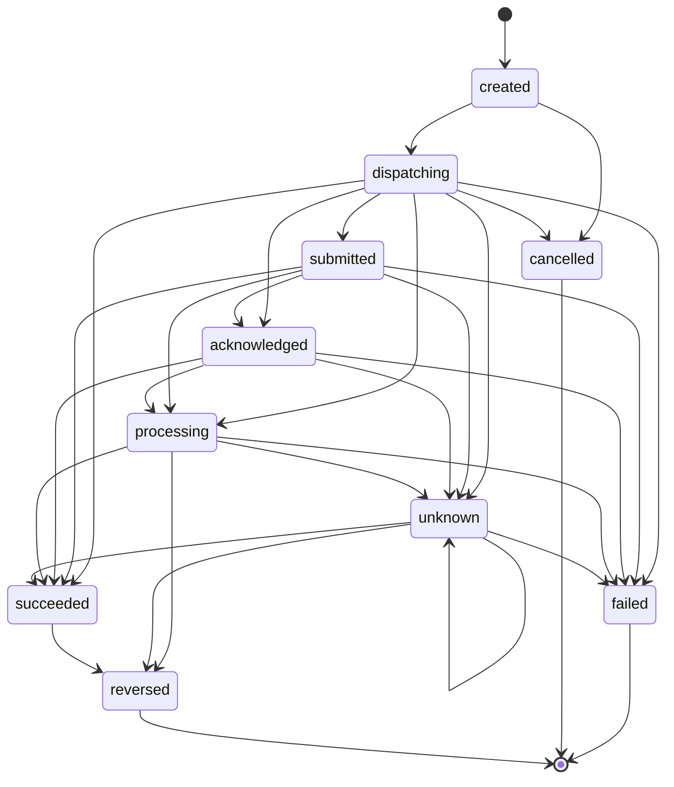
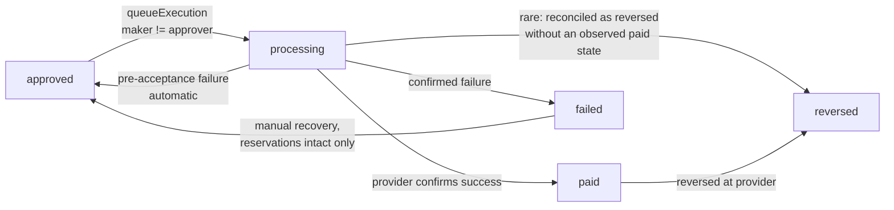
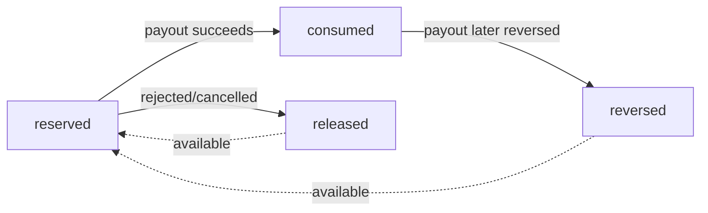
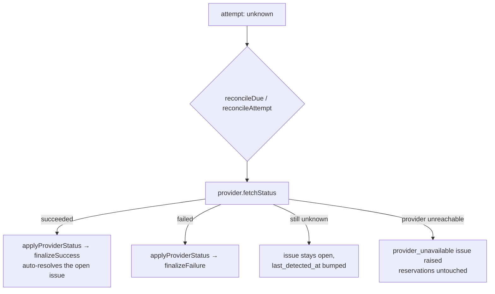
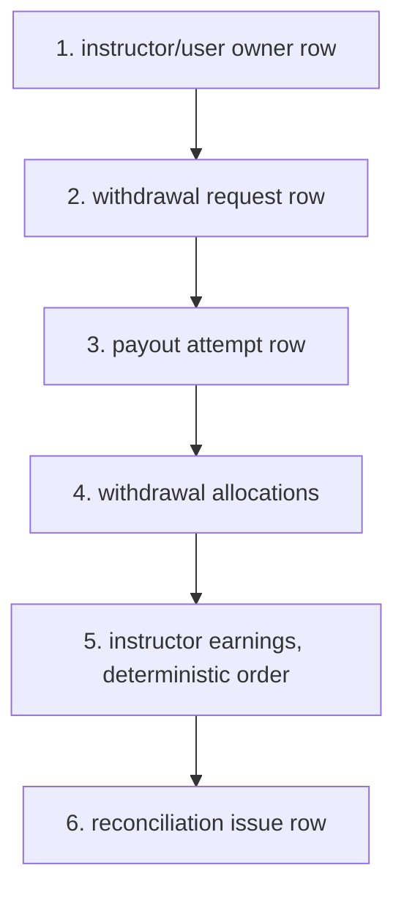

# Phase 16A — Provider-Neutral Instructor Payout Execution & Reconciliation Foundation

The canonical, always-current reference for this domain is
[docs/financial-domain-architecture.md](financial-domain-architecture.md).
This document is the detailed Phase 16A record: the internal
payout-execution architecture, proved end-to-end against a
deterministic fake provider, with no external payout API, credential,
or webhook anywhere in the codebase.

## 1. Scope

Everything needed to take an **approved** withdrawal request through to
**paid** (or a well-defined failure/reversal), entirely inside the
platform, without ever moving real money: payout attempts,
provider-neutral contracts, a fake provider, maker-checker
authorization, idempotent initiation, crash-window safety, failure
classification, bounded retry, reversal handling, reconciliation, and
the event-receipt foundation Phase 16B's webhook controller will reuse.
`payout_execution_enabled` — like `earnings_enabled`,
`periodic_compensation_enabled`, and `withdrawals_enabled` — defaults
**false** and stays false at the end of this phase.

## 2. Provider-neutral architecture

`InstructorPayoutProviderInterface` is the payout boundary:
`providerName()`, `supportsCurrency()`, `validateDestination()`,
`initiate()`, `fetchStatus()`, `cancelWhenSupported()`,
`normalizeEvent()`, `healthCheck()`. It is deliberately **not** the
same interface as `Booking\Contracts\PaymentProviderInterface` — that
interface is checkout semantics (create a payment, refund it, parse a
webhook for a *purchase*); this one is payout semantics (initiate a
transfer, poll its status, reverse it, normalize a *payout* event).
Conflating the two would let a change on one side silently break the
other. `InstructorPayoutProviderRegistry` (mirrors
`Booking\Registry\PaymentProviderRegistry`) holds registered providers;
`InstructorPayoutProviderResolver` (mirrors
`Booking\Services\PaymentProviderResolver`) is the single seam that
checks `payout_execution_enabled`, currency support, and provider
health before anything is allowed to call a provider — a raw
`$registry->get()` skips all of that. Only `fake` is registered in
Phase 16A; attempting to configure `razorpayx`/`stripe`/`wise`/`paypal`
fails at resolution because no adapter exists (proven by an
architecture test).

## 3. Attempt lifecycle

`InstructorPayoutAttemptStatus`: `created → dispatching → {submitted,
acknowledged, processing, succeeded, failed, unknown} …`. A single
synchronous provider call can legitimately report **any** of those as
its immediate outcome directly from `dispatching` — a fast (or fake)
provider does not have to pass through every intermediate state.
`succeeded → reversed` is the only transition out of an otherwise
terminal success. `unknown` only ever resolves through reconciliation
using provider-confirmed evidence, never an unguarded retry. `failed`,
`cancelled`, and `reversed` are fully terminal for the attempt row —
history is never mutated after that point; a fresh execution gets a
new `execution_sequence` on the same withdrawal, never a reused row.

## 4. Withdrawal lifecycle (execution segment)

`approved → processing` only through
`InstructorPayoutExecutionService::queueExecution()`.
`processing → paid` requires a provider-confirmed success.
`processing → approved` is automatic when the attempt fails **before**
the provider ever acknowledged it (safe to try again immediately, no
manual step). `processing → failed` when the provider confirms the
failure (permanent or retry-exhausted). `processing → reversed` exists
for the rare case where reconciliation discovers a payout that
completed and was reversed at the provider without the platform ever
observing the intermediate `paid` state — handled by internally
applying success, then reversal, so the ledger honestly shows "paid,
then reversed" rather than skipping straight to reversed.
`paid → reversed` is the normal reversal path. `failed → approved` is
an **explicit, authorized recovery** (never automatic) and only
succeeds when the withdrawal's reservations are still fully intact — a
permanent-failure withdrawal releases its reservations and therefore
cannot recover this way; the instructor needs a new withdrawal instead.

## 5. Allocation lifecycle

`WithdrawalAllocationStatus`: `reserved → consumed → reversed`,
`reserved → released`. Only `reserved` and `consumed` count as
"unavailable" in `InstructorWithdrawalBalanceService::calculate()`;
`released` and `reversed` are both available again — simply by
exclusion from that sum, no special-case code needed. Consumed
allocations are **never** mutated back to released; a reversal creates
a distinct `reversed` row-state so the full history (reserved → paid →
returned) stays visible. `InstructorEarning.status` is **not** mutated
by any of this — see §12 for why.

## 6. Maker-checker

`payout_maker_checker_enabled` (default **on**). Enforced
authoritatively inside `queueExecution()`: the actor executing may not
be the withdrawal's own `approved_by`. This is a financial invariant,
not a UI nicety — the Filament "Queue for Execution" button's
`->authorize()` is a convenience layer only; the service re-checks
regardless of caller. No emergency super-admin bypass exists: the
service's maker-checker check does not special-case `super_admin` at
all, so even a super-admin who approved a withdrawal cannot execute
its payout. This was a deliberate choice (§16 of the phase spec:
"Prefer no emergency bypass in Phase 16A") — if a genuine emergency
path is ever needed, it should be a separately audited, reason-required
permission added explicitly, not a silent gap in this check.

## 7. Idempotency

Every attempt gets a server-minted UUID `idempotency_key` (never
caller-supplied) and a keyed HMAC `request_fingerprint` (§8). The
concurrency guard for "only one attempt per withdrawal at a time" is
the **same row-lock pattern already proven** everywhere else in this
domain: `queueExecution()` locks the owner (instructor) row, then the
withdrawal row, checks `status->isExecutable()`, and only then creates
the attempt and flips the withdrawal to `processing` — all inside one
transaction. A second concurrent call blocks on the row lock and, once
it proceeds, sees `processing` (not `approved`) and refuses. This was
proven with a real two-process MySQL race
(`test_concurrent_execution_of_the_same_withdrawal_creates_exactly_one_attempt`).
Provider-level idempotency: the fake provider's `initiate()` is a pure
function of `(idempotencyKey, scenario)` — replaying the same attempt
(same key) always returns the same `provider_payout_id`.

## 8. Request fingerprint

`PayoutRequestFingerprintService` computes a keyed (HMAC-SHA256, app
key) fingerprint over: withdrawal ID, execution sequence, amount,
currency, snapshot schema version, a hash of the destination snapshot,
provider, and purpose. Deterministic — the same inputs always produce
the same fingerprint — but not derivable without the application key,
so it is safe to store without leaking destination details. Its
purpose is structural: it is what a future caller would compare against
to detect "same idempotency key, different content" (§15 of the phase
spec). In this phase's actual code paths, every attempt's idempotency
key is freshly minted per execution, so this exact conflict cannot
occur through normal use; the fingerprint mechanism itself is unit-
tested for determinism and amount-sensitivity.

## 9. Crash-window handling

| Window | Handling |
|---|---|
| Crash before the provider call | Attempt stays at `created`/`dispatching`; a retry (manual or the bounded automatic policy) reuses the same attempt and idempotency key — never a second logical execution. |
| Provider accepted, response lost | Attempt becomes `unknown`; reconciliation fetches status using the stored `provider_payout_id`; a reconciliation issue is raised; no second provider call is ever made for this attempt while it is `unknown`. |
| Provider returned success, local commit failed | The attempt row and the transaction are one unit — `finalizeSuccess()` either fully commits (allocations consumed + withdrawal paid + attempt succeeded) or fully rolls back; a subsequent reconciliation fetch/event safely completes it exactly once (`persistProviderOutcome`'s terminal-state guard makes this idempotent). |
| Local success committed, duplicate event arrives | `handleNormalizedEvent()` is idempotent on `(provider, provider_event_id)`, backstopped by a DB unique constraint (a racing duplicate insert is caught and recorded, never crashes); a duplicate is recorded as `ignored` with a link to the original, never reapplied. |
| Timeout with unknown acceptance | Never classified as an ordinary retryable failure — the `provider_timeout_unknown_acceptance` category always lands the attempt in `unknown`, gated from any retry until reconciled. |

Every one of these is covered by a dedicated test in
`tests/Feature/Earnings/PayoutExecutionTest.php`, and the "duplicate
event" and "concurrent execution" windows additionally by a real
multi-process MySQL race in
`tests/Feature/Earnings/Concurrency/PayoutExecutionConcurrencyTest.php`.

## 10. Failure categories

`PayoutFailureCategory`: `pre_provider_validation`, `provider_rejected`,
`provider_retryable`, `provider_permanent`,
`provider_timeout_before_acceptance`,
`provider_timeout_unknown_acceptance`, `provider_unavailable`,
`local_persistence_failure`, `reconciliation_required`,
`destination_invalid`, `insufficient_provider_balance`,
`configuration_error`. Two independent methods drive behavior:
`releasesReservation()` (true only for `provider_permanent` and
`destination_invalid`) and `isSafeForAutomaticRetry()` (true only for
`provider_retryable`, `provider_timeout_before_acceptance`, and
`provider_unavailable` — categories where duplicate execution is
provably impossible). The withdrawal-level outcome, though, is decided
by whether the provider ever **acknowledged** the attempt
(`acknowledged_at !== null`), not by category alone: a failure the
provider never saw always returns to `approved` automatically,
regardless of category; a failure the provider confirmed always lands
in `failed`, and only then does `releasesReservation()` decide whether
the reservation comes back to the pool.

## 11. Retry rules

`payout_auto_retry_enabled` defaults **off**. When on, only categories
where `isSafeForAutomaticRetry()` is true retry automatically, reusing
the same attempt and idempotency key, with backoff
`min(60, 5 × attempt_count)` minutes up to `payout_max_attempts`.
`unknown` outcomes are never retried automatically under any setting —
only reconciliation, using provider-confirmed evidence, can move them
forward. A successful or reversed payout is never retried. Manual retry
(`Retry:InstructorPayoutAttempt`, mandatory reason) is the single entry
point for everything else: it re-dispatches a still-open, non-terminal
attempt immediately (bypassing the backoff delay), performs the
`failed → approved` recovery when reservations are intact, or refuses
outright — including for `unknown` attempts, which must be reconciled
first, and for withdrawals with nothing left to retry (paid, reversed,
rejected, cancelled).

## 12. Reversal handling

`finalizeReversal()` locks withdrawal → attempt → (consumed)
allocations → earnings, in the canonical order, transitions consumed
allocations to `reversed`, the attempt to `reversed`, and the withdrawal
`paid → reversed`, and raises a `reversed_payout` reconciliation issue
(always — a reversal is inherently ops-visible even though it is fully
handled automatically). No new earning is created to represent the
returned funds: `InstructorEarning.status` is never touched by any part
of the withdrawal/payout pipeline (a **deliberate deviation** from the
Phase 14.5 handoff note, which assumed earnings would transition to
`settled` on payout success — see §13b of the canonical doc for the
full rationale). Because the earning row never changes, "the money
becomes available again" falls out for free from the allocation status
alone: once `reversed`, that amount simply stops being subtracted in
the balance calculation, and a brand new withdrawal can reserve it.
Reversal is idempotent — `finalizeReversal()` is only ever reached
through `persistProviderOutcome()`'s guarded dispatch, which refuses to
process a second outcome once the attempt is already terminal.

## 13. Reconciliation

`InstructorPayoutReconciliationService::reconcileDue()` selects
attempts in `submitted`/`acknowledged`/`processing`/`unknown` whose
`last_synced_at` is older than `payout_unknown_timeout_minutes` (or
null), in deterministic `created_at, id` order, fetches provider
status, and applies it through the **exact same**
`InstructorPayoutExecutionService::applyProviderStatus()` code path
every other caller uses — reconciliation never has its own, separate
finalize logic to drift out of sync with. Mismatches and unconfirmed
outcomes raise `InstructorPayoutReconciliationIssue` rows (idempotent
per withdrawal+type via a DB-level generated-column unique key); when a
previously-`unknown` attempt resolves to a terminal state, the matching
open issue auto-resolves with `resolution_type = auto_reconciled`.
Manual resolution (`Resolve:InstructorPayoutReconciliationIssue`,
mandatory evidence note) only ever closes the issue row — it
structurally cannot mark a withdrawal paid; only a provider-confirmed
outcome, applied through the finalize path, can do that.

## 14. Provider-event foundation

`InstructorPayoutProviderEvent` is the foundation Phase 16B's public
webhook controller will write into — Phase 16A itself has **no public
route** for it; events are only ingested internally
(`handleNormalizedEvent()`, exercised by tests and the fake provider's
own `normalizeEvent()` signature-verification pattern, mirroring
`FakePaymentProvider`'s HMAC convention). `payload_hash` gives duplicate
detection independent of `provider_event_id`, for a provider that might
reissue the same logical event under a new ID. Invalid events (unknown
`provider_payout_id`, amount/currency mismatch) are recorded with
`processing_status = invalid` and — for mismatches — raise a critical
reconciliation issue; neither ever mutates financial state.

## 15. Lock order

Applies, in the same relative order, to queueing execution,
provider-result persistence, success/failure/reversal finalization,
manual retry, and duplicate-event/reconciliation processing. The
provider call itself always happens **outside** any open transaction
(`execute()` claims the attempt in one short transaction, calls the
provider with no lock held, then persists the result in a second short
transaction) — a slow or hanging provider call can never hold a
database lock. No deadlock-retry wrapper exists; an InnoDB 1213 here is
a lock-order regression to fix, never a signal to retry the provider
call.

## 16. Queue design

`InitiateInstructorPayout` carries only the attempt **ID** — never
decrypted destination data — so `failed_jobs` and any queue-payload
inspection never expose bank details. `$tries = 1`: a Laravel-level job
retry would risk a second provider call on pure infrastructure failure
(worker crash, DB blip); the payout's own retry policy is entirely
owned by the service, which re-dispatches the job itself, with a delay,
only when a retry is provably safe. A queue infrastructure failure is
therefore never treated as a payout failure — it surfaces as a visibly
failed job without touching any reservation or withdrawal status.
`ShouldBeUnique` (keyed on the attempt ID) prevents a duplicate queued
dispatch of the same attempt from ever running concurrently on two
workers.

## 17. Permissions

`ViewAny/View/Execute/Retry/Cancel/Reconcile:InstructorPayoutAttempt`,
`ViewAny/View/Assign/Resolve:InstructorPayoutReconciliationIssue`,
`Configure:InstructorPayoutExecution` — seeded idempotently by
`InstructorPayoutExecutionPermissionSeeder`. No Update/Delete
permission exists for either resource (both are immutable financial
records — `InstructorPayoutAttemptPolicy`/
`InstructorPayoutReconciliationIssuePolicy` hard-deny both regardless
of role). No manual mark-paid permission exists anywhere in the
codebase. The instructor receives **none** of these permissions.
`executePayout`/`retryPayout` methods on the existing
`InstructorWithdrawalRequestPolicy` gate the two Filament actions that
operate on the withdrawal record itself (queue for execution, retry) —
permission-only checks; the maker-checker business rule is enforced
authoritatively by the service, not duplicated in the policy.

## 18. Settings and preflight

Four switches now: `earnings_enabled`, `periodic_compensation_enabled`,
`withdrawals_enabled`, `payout_execution_enabled` — all guarded by the
same `InstructorEarningSettings::save()` override, all four routed
exclusively through `FinancialFeatureConfigurationService`.
`evaluatePayoutExecutionReadiness()` checks: earnings enabled,
withdrawals enabled, the configured provider registered and healthy,
the reconciliation command registered, the payout-attempt/withdrawal
DB constraints present, the allocation-reversal column present, a
queue connection configured, and no unresolved critical reconciliation
issue. Enabling it additionally requires the
`Configure:InstructorPayoutExecution` permission, checked in the
Filament settings page's `save()` (server-side; the form field itself
is not disabled client-side, since Filament silently drops disabled-
field values from submitted state, which would make the server-side
check unreachable for the very users it needs to reject — the
permission check is what's authoritative, not a UI affordance).
Disabling `payout_execution_enabled` never touches `withdrawals_enabled`
— confirmed by test — because requests only ever reserve earnings; they
do not require provider readiness.

## 19. Fake provider

`FakeInstructorPayoutProvider` never makes a network call (proven by an
architecture test scanning its source for HTTP client usage) and is
fully deterministic: given the same `(idempotencyKey, scenario)` it
always returns the same synthetic `provider_payout_id`. Eleven
scenarios are supported (`success_immediate`, `success_async`,
`failure_retryable`, `failure_permanent`, `timeout_before_acceptance`,
`timeout_after_acceptance`, `unknown`, `reversed_after_success`,
`queued`, `processing`, `duplicate_event`); the default when no
scenario is specified is `success_immediate`, so any code path that
never sets one behaves predictably rather than randomly. The scenario
is carried on `InstructorPayoutAttempt.requested_fake_scenario` — a
column that is never mass-assignable, never exposed in any form or API
response, and explicitly ignored by the interface contract for any
real adapter. For scenarios where a later `fetchStatus()` call needs to
recall which behavior to simulate (e.g. `reversed_after_success`), the
scenario name is embedded directly in the (otherwise opaque, fake-only)
`provider_payout_id` string itself — safe only because every byte there
is synthetic test data, and it means `fetchStatus()` needs no shared
state, working correctly even across the separate OS processes the
concurrency test harness uses. The resolver additionally refuses to
select the fake provider outside `local`/`testing` environments unless
`payout_fake_provider_staging_enabled` is explicitly set — a deliberate
convenience for a future staging simulation environment, never a
production payout path.

## 20. Test coverage

- `tests/Feature/Earnings/PayoutExecutionTest.php` — 31 tests: provider
  contract, maker-checker, execution integrity, success finalization
  (including partial-allocation remainder and settlement exclusion),
  failure finalization (pre-acceptance / permanent / unknown), reversal
  (including idempotency), event processing (duplicate / unknown
  reference / amount mismatch), reconciliation, and policies.
- `tests/Feature/Earnings/Concurrency/PayoutExecutionConcurrencyTest.php`
  — 4 real two-process MySQL races on the proven
  `tests/Concurrency/run-op.php` harness: concurrent execution of the
  same withdrawal, concurrent duplicate provider events, settlement
  racing a concurrent payout, and concurrent manual retries against an
  already-paid withdrawal. Run three consecutive times with zero
  flakes.
- `tests/Feature/Earnings/FinancialArchitectureTest.php` — extended
  with 5 new Phase 16A checks: only the fake provider is registered, no
  external-provider code or network call exists anywhere in
  `app/Earnings`, the payout DTO carries no forbidden field, no manual
  mark-paid action exists, and no UI layer mutates payout-attempt status
  directly.
- `tests/Feature/Earnings/FinancialConfigurationTest.php` — extended
  with 6 new tests covering the fourth switch's write-guard, readiness
  evaluation, the documented independence from `withdrawals_enabled`,
  the Filament permission gate, and the new schema constraints; plus a
  new immutability test for the two Phase 16A models.
- `tests/Feature/Earnings/FinancialGoldenPathTest.php` — extended with
  a direct confirmation that `payout_execution_enabled` defaults false
  and blocks the provider resolver.
- Full suite: **2,573 tests / 10,121 assertions**, zero regressions.

## 21. Explicitly deferred RazorpayX integration

No RazorpayX (or any other) account setup, Contacts/Fund-Account
creation or validation, adapter implementation, credentials, IP
allowlisting, signed webhook endpoint, provider-specific status
mapping, sandbox verification, provider-specific reconciliation logic,
or production rollout exists in this phase. `grep`-verified: zero
occurrences of `razorpayx`, `api.razorpay`, `stripe connect`, or `wise`
as actual code anywhere in `app/Earnings` (the only matches are the
English word "otherwise" and this document's own deferred-work
references).

## 22. Phase 16B handoff

See canonical doc §13c for the full handoff note. In short: implement
`InstructorPayoutProviderInterface` for the real provider, register it,
centralize its status mapping inside the adapter, add a signed public
webhook that feeds the already-built
`handleNormalizedEvent()`/`InstructorPayoutProviderEvent` foundation,
supply credentials outside application code, and pass the exact same
test suite this phase built (feature + concurrency) against a sandbox
before ever enabling `payout_execution_enabled` in production.
