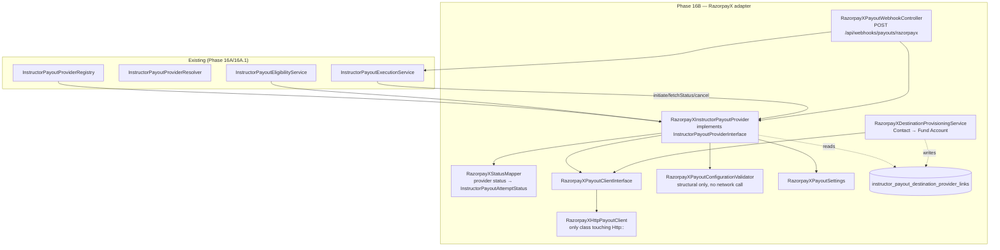
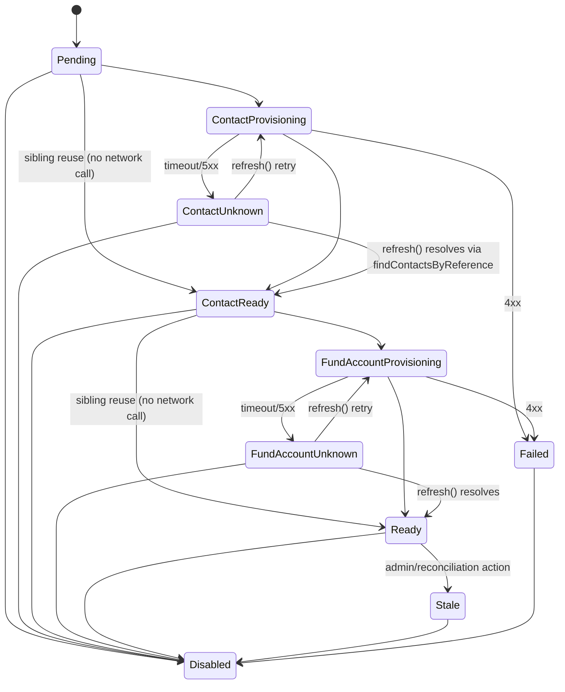
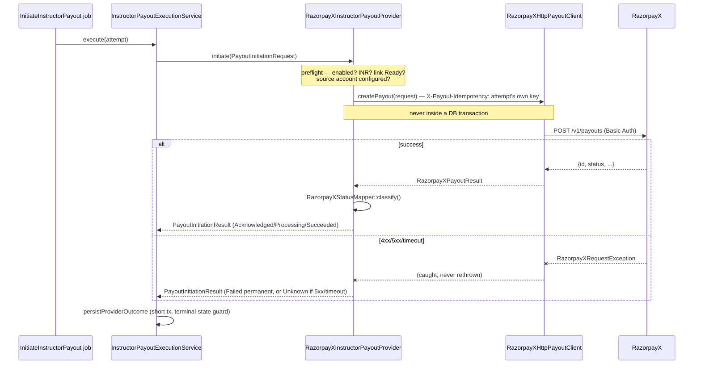
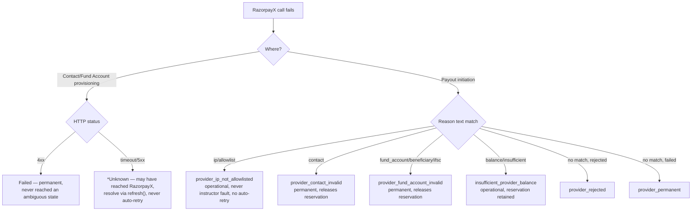
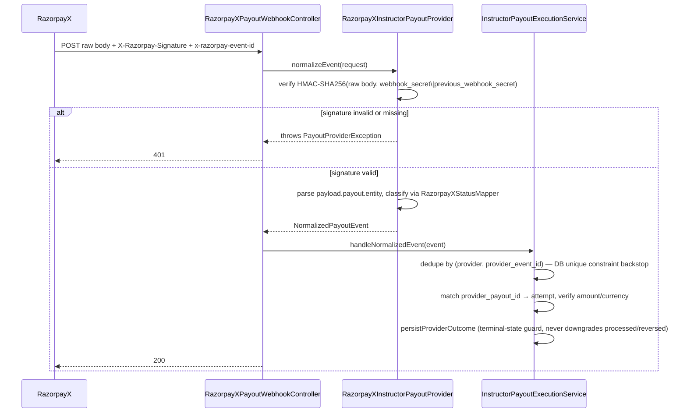
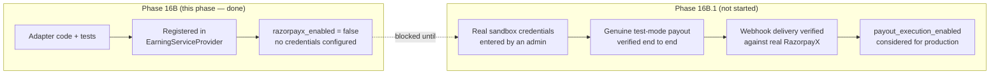

# Phase 16B — RazorpayX India/INR Instructor Payout Adapter

The canonical, always-current reference for the wider financial domain
is [docs/financial-domain-architecture.md](financial-domain-architecture.md).
This document is the detailed Phase 16B record: the first real
(non-fake) `InstructorPayoutProviderInterface` adapter, connecting the
provider-neutral payout execution foundation (Phase 16A) and
routing/eligibility layer (Phase 16A.1) to RazorpayX for India/INR
instructor withdrawals.

**Status: code-complete, registered, tested — not enabled.**
`razorpayx_enabled` and `payout_execution_enabled` both default false;
no credential is configured; nothing in this phase performs a real
payout. A separate Phase 16B.1 controlled test-mode activation audit
is required before any RazorpayX credential is entered outside a
local/CI environment.

## 1. Scope

**Built:** RazorpayX settings + structural config validation; a
`RazorpayXPayoutClientInterface` HTTP boundary (Contact, Fund Account,
Payout create/fetch/cancel, balance/health); Contact → Fund Account
destination provisioning with reuse-before-create and concurrency-safe
claiming; the `RazorpayXInstructorPayoutProvider` adapter (capabilities,
destination validation, initiate, fetch status, cancel, webhook
normalization, health check); a dedicated signed webhook route;
RazorpayX-specific failure categories and reconciliation issue types;
RazorpayX-specific `evaluatePayoutExecutionReadiness()` checks; 8
RazorpayX-specific permissions; a dedicated admin settings page and
payout-method provisioning actions; unit/feature/concurrency tests.

**Explicitly not built this phase:** Stripe collection work (Phase
16C); international (non-India) instructor payouts; tax/TDS
withholding; currency conversion; production activation of
`payout_execution_enabled` or `razorpayx_enabled` (Phase 16B.1); any
other payout provider.

## 2. Why an HTTP client, not the `razorpay/razorpay` SDK

Audited before writing any code (§8 of the phase spec). The installed
SDK (`razorpay/razorpay` 2.9.3) exposes a `FundAccount` resource class
but **no `Contact` or `Payout` resource class** — `Api::__get($name)`
dynamically instantiates `Razorpay\Api\{Ucwords($name)}`, so
`$api->contact` or `$api->payout` would fatal-error against this SDK
version. Rather than mix SDK (Fund Account only) with raw HTTP
(Contact and Payout — the other two RazorpayX operations touching the
exact same product), `RazorpayXHttpPayoutClient` uses Laravel's `Http`
facade with Basic Auth for all three, matching the same
authentication scheme the SDK itself uses internally. This is the
**only** class in the codebase that issues an HTTP request to
RazorpayX — enforced by
`RazorpayXArchitectureTest::test_no_hardcoded_razorpay_api_base_url_outside_the_http_client()`
and `FinancialArchitectureTest::test_no_undeclared_external_payout_provider_or_stray_http_call_exists()`.

## 3. Architecture

## 4. Settings (`RazorpayXPayoutSettings`, group `razorpayx_payout`)

A dedicated settings class — never folded into `InstructorEarningSettings`
(too many fields, different confidentiality/rotation lifecycle) or
`PaymentGatewaySettings` (a different product: student collection, not
instructor payout). 19 fields; secrets `Crypt::encryptString()`'d on
save, never re-displayed after initial submission. Defaults:
`razorpayx_enabled = false`, `razorpayx_environment = 'test'`,
`razorpayx_queue_if_low_balance = false`, `razorpayx_default_purpose = 'payout'`,
`razorpayx_default_mode = 'IMPS'`, `razorpayx_contact_provisioning_enabled = false`,
`razorpayx_fund_account_provisioning_enabled = false`,
`razorpayx_config_status = 'not_configured'`. Collection-side
(`PaymentGatewaySettings::razorpay_webhook_secret`) and payout-side
(`razorpayx_webhook_secret`) secrets are structurally separate fields
in separate settings classes — never cross-read.

`razorpayx_ip_allowlisting_confirmed_at`/`_by` is an explicit,
admin-confirmed operational control — never inferred from
`razorpayx_expected_outbound_ips` merely being non-empty. Readiness
(§11) requires the confirmation timestamp, not just the IP list.

## 5. Configuration validation vs. health check

Two deliberately separate checks:

- **`RazorpayXPayoutConfigurationValidator::issues()`** — pure,
  local, structural (format/presence of key_id, key_secret,
  webhook_secret, account_number, environment, outbound IPs, IP
  allowlisting confirmation, transfer mode, purpose, and a
  key/environment consistency check). **Never a network call.**
- **`RazorpayXInstructorPayoutProvider::healthCheck()`** — a genuine
  network probe via `RazorpayXPayoutClientInterface::fetchBalanceOrHealth()`.
  Deliberately **not** called from `capabilities()` (which is read on
  every eligibility resolution — a live network call on that hot path
  would be both slow and unnecessary load); `capabilities()` uses only
  the cheap structural check, mirroring
  `Booking\Payments\RazorpayPaymentProvider::capabilities()`.

## 6. Destination provisioning (Contact → Fund Account)

`InstructorPayoutDestinationProviderLink` (`instructor_payout_destination_provider_links`,
unique on `(payout_method_id, provider)`, soft deletes only, no bank
details stored — only opaque provider identifiers and a keyed-HMAC
`bank_details_fingerprint` for drift detection). One instructor maps
to exactly one RazorpayX Contact (deterministic reference
`ins_<hash of instructor id>`, ≤ 40 chars); Fund Accounts are reused
across payout methods when the Contact and bank-details fingerprint
match; changed bank details never mutate an existing `Ready` link — a
new payout method gets its own link instead (§7).

`*Unknown` states exist because a provisioning call can time out after
RazorpayX already accepted it — they are never auto-retried with a
fresh Contact/Fund Account, only resolved via `refresh()` (which
re-checks `findContactsByReference()` before ever creating anything
new) or admin/reconciliation action.

**Concurrency safety.** Every state transition that decides "reuse
existing vs. call the provider" happens inside a locked, short DB
transaction on the link row (`SELECT ... FOR UPDATE`) — the network
call itself always happens *outside* that lock. A caller that loses
the claim race safely returns the link's current (possibly in-flight)
state rather than erroring or creating a duplicate Contact/Fund
Account. `findOrCreateLink()`'s insert is wrapped with
`DB::transaction($closure, attempts: 3)` because a `SELECT ... FOR
UPDATE` against a not-yet-existing row takes a MySQL gap lock, and two
concurrent first-time provisioning calls can legitimately deadlock on
the subsequent `INSERT` — a well-documented MySQL behavior, not a
data-integrity problem; Laravel retries the whole closure
automatically. Proven by a real 2-process race, 3× consecutive green
(`tests/Feature/Earnings/Concurrency/RazorpayXDestinationProvisioningConcurrencyTest.php`).

## 7. Payout initiation mapping

`RazorpayXInstructorPayoutProvider::initiate()` builds a
`RazorpayXPayoutRequest` exclusively from: the withdrawal's immutable
destination snapshot (never the live, mutable payout method), the
attempt's own idempotency key (set as the `X-Payout-Idempotency`
header — never a freshly minted key on retry), the Fund Account ID
from the destination's `Ready` provider link, and
`RazorpayXPayoutSettings::razorpayx_account_number` (the platform's own
source account — never a per-instructor value). No student price,
platform margin, or decrypted bank details cross this boundary (bank
details are decrypted once, transiently, only inside
`RazorpayXDestinationProvisioningService::ensureFundAccount()`, and
`unset()` immediately after the client call). The provider call always
happens outside any open database transaction. A pre-flight failure
(destination not `Ready`, currency not INR, RazorpayX disabled, no
source account configured) throws `PayoutProviderException` — these
represent a bug/misconfiguration upstream, since
`InstructorPayoutExecutionService`'s own preflight should have already
confirmed readiness. A provider-side failure (the HTTP call itself
fails) is **never** thrown — it becomes a `PayoutInitiationResult`
with `Failed`/`Unknown` status, exactly like every other provider.

### Initiation sequence

## 8. Status normalization

`RazorpayXStatusMapper` is the single place a RazorpayX status string
is translated into `InstructorPayoutAttemptStatus`:

| RazorpayX status | Internal status | Notes |
|---|---|---|
| `queued` | `Acknowledged` | accepted, not yet processing |
| `pending` | `Acknowledged` | **not success** — may be held by RazorpayX's own Approval Workflow |
| `processing` | `Processing` | |
| `processed` | `Succeeded` | the **only** mapping to success |
| `cancelled` | `Cancelled` | only reachable pre-processing |
| `reversed` | `Reversed` | `ReconciliationRequired` category |
| `rejected` | `Failed` | pre-acceptance validation rejection |
| `failed` | `Failed` | post-acceptance failure |
| anything else | `Unknown` | `ReconciliationRequired` — never assumed success or failure |

`processed`/`reversed` are terminal in the existing
`InstructorPayoutAttemptStatus` state machine (Phase 16A) — a later,
stale event can never downgrade them; this is enforced generically by
`InstructorPayoutExecutionService::persistProviderOutcome()`, unchanged
by this phase.

Raw provider description text (`failure_reason`) is inspected **only**
internally for classification — it is never the outward-facing
`safeReason` (always one of a small set of fixed, generic messages).
The raw text is preserved solely inside `safeMetadata['provider_status_details']`,
which becomes `InstructorPayoutAttempt.encrypted_provider_metadata` —
encrypted at rest, `$hidden` from every serialization, finance/admin
visibility only.

## 9. Failure classification

Three RazorpayX-specific categories added to `PayoutFailureCategory`
(12 existing + 3 new = 15 total, matching the spec's named count):

| Category | Releases reservation? | Operational (not instructor fault)? | Auto-retry safe? |
|---|---|---|---|
| `provider_ip_not_allowlisted` | No | **Yes** | No |
| `provider_contact_invalid` | **Yes** (permanent destination failure) | No | No |
| `provider_fund_account_invalid` | **Yes** (permanent destination failure) | No | No |

Auth/IP/configuration errors are never blamed on the instructor and
never auto-retried (a config fix is required, not a retry). An invalid
Contact or Fund Account is a permanent failure requiring a corrected
payout method — reservations release so the money returns to the pool
rather than waiting indefinitely on an unfixable destination.

`RazorpayXDestinationProvisioningService::failProvisioningStep()`
classifies provisioning-time failures independently: an HTTP 4xx
(validation-shaped) is treated as permanent (`Failed`) since the
request never reached an ambiguous "maybe created" state at RazorpayX;
anything else (timeout, connection error, 5xx) becomes `*Unknown`,
requiring reconciliation rather than a silent retry.

### Failure classification decision

## 10. Webhook

`POST /api/webhooks/payouts/razorpayx` (`routes/api.php`) — public,
unauthenticated (no session), CSRF-exempt by convention (mounted under
`routes/api.php`, which never loads the `web` middleware group),
dedicated `razorpayx-payout-webhook` rate limiter (120/min/IP,
`AppServiceProvider::registerRateLimiters()`), deliberately separate
from the booking-payment webhook and the generic payment webhook
scaffold — a different financial domain entirely.

Signature verification is raw-body HMAC-SHA256, constant-time
(`hash_equals`), fails closed when no secret is configured, and
accepts either the current or previous secret during a rotation
window (`razorpayx_webhook_secret` / `razorpayx_previous_webhook_secret`,
rotated via the settings page's "Rotate webhook secret" action).
Deduplication (`x-razorpay-event-id`), amount/currency mismatch →
reconciliation issue, and terminal-state protection are all handled by
the **existing, unmodified** `InstructorPayoutExecutionService::handleNormalizedEvent()`
(Phase 16A) — this phase adds no new event-processing logic, only a
new event *source*. Proven end-to-end (not just unit-tested) by
`tests/Feature/Earnings/RazorpayX/RazorpayXPayoutWebhookTest.php`:
processed → succeeded/paid, invalid signature → 401 with no mutation,
duplicate event id → no additional financial effect, a stale `pending`
event arriving after `processed` → no downgrade, previous-secret
rotation window accepted.

## 11. Reconciliation extension

11 RazorpayX-specific `PayoutReconciliationIssueType` cases added
(prefixed `razorpayx_*`, never used by any other provider):
`razorpayx_contact_provisioning_unknown`,
`razorpayx_fund_account_provisioning_unknown`,
`razorpayx_contact_mismatch`, `razorpayx_fund_account_mismatch`,
`razorpayx_payout_status_unknown`,
`razorpayx_utr_missing_after_processed`, `razorpayx_utr_mismatch`,
`razorpayx_queued_stale`, `razorpayx_webhook_event_conflict`,
`razorpayx_ip_allowlisting_revoked`,
`razorpayx_duplicate_payout_reference`. The existing generic
reconciliation machinery (`InstructorPayoutReconciliationService`,
Phase 16A) raises these the same way it raises any other issue type —
no reconciliation-service code changed. `refresh()` (destination
provisioning) is the manual/scheduled resolution path for the two
`*_provisioning_unknown` types; the payout-status types are resolved
the same way any other attempt-level reconciliation issue is (fetch by
ID, never a second payout to "fix" an uncertain first one — the same
invariant Phase 16A already established).

## 12. Payout execution readiness extension

`FinancialFeatureConfigurationService::evaluatePayoutExecutionReadiness()`
now runs RazorpayX-specific checks (`razorpayx_disabled`,
`razorpayx_configuration_invalid` — one per structural validator
issue, `razorpayx_contact_provisioning_disabled`,
`razorpayx_fund_account_provisioning_disabled`,
`razorpayx_rollout_scope_disabled`,
`razorpayx_destination_link_table_missing`,
`razorpayx_destination_link_constraint_missing`) **only when**
`InstructorEarningSettings::payout_provider === 'razorpayx'`. The
provider's own `healthCheck()` (a real network probe) is already
covered by the pre-existing generic `provider_unhealthy` check — never
duplicated. This method still never enables payout execution itself —
it only reports readiness; `payout_execution_enabled` is flipped
exclusively through `FinancialFeatureConfigurationService::enablePayoutExecution()`,
unchanged from Phase 16A.

## 13. Permissions

`RazorpayXPayoutPermissionSeeder` grants 8 permissions to `manager`:
`Configure`, `TestConnection`, `ConfirmIpAllowlisting`,
`ProvisionDestination`, `RefreshDestination`, `ViewProviderDetails`,
`ProcessWebhook`, `Reconcile` — all suffixed `:RazorpayXPayout`.
Deliberately **no** Manage/MarkPaid/Delete/Edit/Execute permission —
actual payout execution still requires the existing
`Execute:InstructorPayoutAttempt` permission (Phase 16A); RazorpayX
adds no new way to move money, only to configure and provision a
destination for the existing execution pipeline to use. Maker-checker
(execution permission separate from approval) is unchanged.

## 14. Admin UI

- **`RazorpayXPayoutSettingsPage`** (`/admin/settings/razorpayx-payout`)
  — masked credentials (never re-displayed), environment/mode/purpose,
  source account number, outbound IP list, destination-provisioning
  toggles, webhook URL (read-only, for copying into the RazorpayX
  dashboard), and actions: **Validate configuration** (structural,
  no network call), **Check health** (real network probe, gated by
  `TestConnection:RazorpayXPayout`), **Confirm IP allowlisting**
  (explicit confirmation modal, gated by `ConfirmIpAllowlisting:RazorpayXPayout`),
  **Rotate webhook secret** (moves current → previous, gated by
  `Configure:RazorpayXPayout`), **Clear invalid credentials**. No
  action performs a real production payout.
- **`InstructorPayoutMethodsTable`** extension — a "RazorpayX" status
  badge column and four record actions: **Provision** (visible only
  for a verified, INR method with no link yet; `ProvisionDestination:RazorpayXPayout`),
  **Refresh** (visible for any non-terminal, non-`Ready` link;
  `RefreshDestination:RazorpayXPayout`), **Mark Stale** (mandatory
  reason, only from `Ready`; `Reconcile:RazorpayXPayout`), **Disable
  Link** (`Configure:RazorpayXPayout`).

## 15. Security

Credentials/secrets (`razorpayx_key_secret`, `razorpayx_webhook_secret`,
`razorpayx_previous_webhook_secret`) are `Crypt::encryptString()`'d at
rest, never re-displayed after submission, and never appear in the
audit trail (`LogsSettingsUpdates::isSensitiveField()` redacts any
field name containing "secret"). Bank details are decrypted only
inside `RazorpayXDestinationProvisioningService::ensureFundAccount()`,
never serialized into a job payload or log line
(`RazorpayXArchitectureTest::test_no_job_class_references_the_fund_account_request_dto_or_payout_method_details()`).
No RazorpayX file logs a raw payload, response, or secret
(`test_no_razorpayx_file_ever_logs_a_raw_provider_payload_or_secret()`).
Webhook signature comparison is constant-time; a missing secret fails
closed. Test-mode and live-mode credentials are structurally distinct
fields with a cross-check (`RazorpayXPayoutConfigurationValidator`
flags a `rzp_live_*` key with `environment = test` or vice versa). The
account-number/base-URL is never admin-configurable in a way that
could redirect requests to an attacker-controlled host — the API base
URL is a hardcoded constant inside `RazorpayXHttpPayoutClient` only.

## 16. Test coverage

| Area | File |
|---|---|
| Structural config validation | `tests/Feature/Earnings/RazorpayX/RazorpayXPayoutConfigurationValidatorTest.php` |
| Status/failure mapping, safe-reason discipline | `tests/Feature/Earnings/RazorpayX/RazorpayXStatusMapperTest.php` |
| Capabilities, validateDestination, initiate, fetchStatus, cancel, webhook signature/rotation, health | `tests/Feature/Earnings/RazorpayX/RazorpayXInstructorPayoutProviderTest.php` |
| Contact/Fund Account provisioning, reuse, timeout/permanent-failure classification, refresh, mark-stale, disable | `tests/Feature/Earnings/RazorpayX/RazorpayXDestinationProvisioningServiceTest.php` |
| End-to-end webhook route (processed, invalid signature, duplicate, stale-downgrade, rotation) | `tests/Feature/Earnings/RazorpayX/RazorpayXPayoutWebhookTest.php` |
| RazorpayX-specific payout-execution readiness | `tests/Feature/Earnings/RazorpayX/RazorpayXPayoutExecutionReadinessTest.php` |
| Permission seeder | `tests/Feature/Earnings/RazorpayX/RazorpayXPayoutPermissionSeederTest.php` |
| Structural guarantees (no stray HTTP calls, no logged secrets, no job-carried bank details, single webhook route) | `tests/Feature/Earnings/RazorpayX/RazorpayXArchitectureTest.php` |
| Real 2-process concurrent-provisioning race, 3× consecutive | `tests/Feature/Earnings/Concurrency/RazorpayXDestinationProvisioningConcurrencyTest.php` |

**Scope decision (proportionate, documented — the same precedent set
in Phase 16A/16A.1):** of the spec's 6 named concurrency scenarios,
one was implemented as a real multi-process MySQL race (concurrent
destination provisioning — the most architecturally significant, and
the one that actually surfaced two real bugs during development: a
gap-lock/insert deadlock and a duplicate-Contact race, both fixed).
The other five (execution-job-vs-webhook-processed race,
duplicate-processed-webhooks, processed-vs-reversed race,
reconciliation-vs-webhook, queued-cancellation-vs-processing-event) are
covered by the **existing, unmodified** Phase 16A concurrency/
event-processing machinery and its own test suite
(`PayoutExecutionConcurrencyTest.php`, `PayoutExecutionTest.php`'s
event-processing section) — RazorpayX's webhook path routes through
that exact same `handleNormalizedEvent()`/`persistProviderOutcome()`
code, so those races are provider-agnostic by construction, not
re-derived per adapter. The webhook Feature test does independently
prove the RazorpayX-specific slice of one of them (stale-pending-after-
processed, §10).

## 17. Known limitations (documented, not hidden)

- **Fund Account provider-side reuse is DB-only.** RazorpayX's Fund
  Account list API returns masked account numbers, so this codebase
  cannot match a *provider-reported* Fund Account against locally-held
  bank details. Reuse is decided entirely from this application's own
  `bank_details_fingerprint`, never by re-deriving from a RazorpayX
  response. Documented, deliberate scope limit — not a bug.
- **`cancelWhenSupported()` has no caller yet.** The interface method
  is implemented correctly (delegates to `cancelQueuedPayout()`), but
  `InstructorPayoutExecutionService::cancelBeforeAcceptance()` (Phase
  16A) only ever cancels an attempt still at `Created`/`Dispatching` —
  before any provider has been called — so it never actually invokes a
  provider's cancel method today, for any provider, RazorpayX
  included. This is a pre-existing Phase 16A architectural boundary,
  not something this phase was scoped to change (guardrail: "must not
  redesign the existing payout domain").
- **UTR is not yet surfaced anywhere in the admin UI.** It is captured
  in `safeMetadata['provider_utr']` (encrypted, hidden) but no
  dedicated masked-UTR display/finance-only-visibility UI was built
  this phase — the data is captured and safe, but not yet presented.

## 18. Troubleshooting

See `docs/financial-domain-architecture.md` §14 for the RazorpayX rows
added to the shared troubleshooting table.

### Phase 16B vs. Phase 16B.1 boundary

## 19. Readiness — what "done" means here

**Code readiness:** Confirmed. Every file listed in §16 exists,
passes `php -l`, and the full Earnings test suite (386 tests) plus all
new RazorpayX-specific tests pass together. Architecture tests prove
the RazorpayX adapter never touches the fake/booking provider
contracts, never issues an HTTP call outside `RazorpayXHttpPayoutClient`,
and never logs a secret or raw payload.

**Account readiness:** **Not applicable / not verified.** No real
RazorpayX account, API key, or webhook has been used at any point in
this phase. Every test uses a mocked `RazorpayXPayoutClientInterface`
or a network-free concurrency-test double
(`Tests\Support\RazorpayXConcurrencyFakeClient`) — never `Http::fake()`
against real RazorpayX endpoints, and never the real API. This is
explicitly out of scope per the phase's own guardrails ("do not use
production credentials in automated tests").

**Test-mode readiness:** Not yet attempted — that is Phase 16B.1's
job specifically (a controlled test-mode activation audit with real
RazorpayX sandbox credentials, a genuine test-mode payout, and
verified webhook delivery).

**Live-mode readiness:** Not applicable. `razorpayx_enabled` and
`payout_execution_enabled` remain off; no production credential
exists anywhere in this codebase or its configuration.

**Do not treat this document as "production ready" merely because the
mocked test suite passes.** It documents what has been built and
proven at the code level, and is explicit about everything that has
not yet been verified against a real RazorpayX account.
